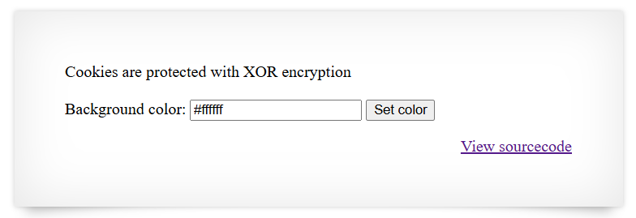

# [Over The Wire (natas)] – [[Platform](http://natas11.natas.labs.overthewire.org/)] – [09/22/2025]

## Objective
Find the password for the next Natas level by exploiting the vulnerability on this page.  

## Environment / Platform
- Platform: OverTheWire – Natas
- Level: [10]
- Difficulty: [Medium]

## Tools Used
- Chromium Browser

## Login
1. Logged in with credentials:
   - **Username**: `natas11`
   - **Password**: `XXXXXX`
  
2. Screenshot:
   
   
   - this prompted that I should check the sourcecode by clicking the link `http://natas11.natas.labs.overthewire.org/index-source.html`

3. Observed Page Content
   
   ```php
         function saveData($d) {
            setcookie("data", base64_encode(xor_encrypt(json_encode($d))));
         }

         $data = loadData($defaultdata);

         if(array_key_exists("bgcolor",$_REQUEST)) {
            if (preg_match('/^#(?:[a-f\d]{6})$/i', $_REQUEST['bgcolor'])) {
               $data['bgcolor'] = $_REQUEST['bgcolor'];
            }
         }

         saveData($data);
   ```
   1. This loads the defaultdata and saves a cookie with key `data` after encoding json. This would take into consideration that the input "bgcolor" is an actual hexcode color syntax. 


   ```php
      function loadData($def) {
      global $_COOKIE;
      $mydata = $def;
      if(array_key_exists("data", $_COOKIE)) {
      $tempdata = json_decode(xor_encrypt(base64_decode($_COOKIE["data"])), true);
      if(is_array($tempdata) && array_key_exists("showpassword", $tempdata) && array_key_exists("bgcolor", $tempdata)) {
         if (preg_match('/^#(?:[a-f\d]{6})$/i', $tempdata['bgcolor'])) {
         $mydata['showpassword'] = $tempdata['showpassword'];
         $mydata['bgcolor'] = $tempdata['bgcolor'];
         }
      }
      }
      return $mydata;
   }
   ```

   2. This indicates that there is a cookie stored with the key `data`. The value needs to be decoded in base64 then xor encrypted and then json decoded. 
   
   3. The tempData might have a key  of `showpassword` and one for `bgcolor`, which is the same as the variable defaultdata.

   4. As long as the object had a value for each key it would copy to the mydata and be displayed.


```php
      function xor_encrypt($in) {
            $key = '<censored>';
            $text = $in;
            $outText = '';

            // Iterate through each character
            for($i=0;$i<strlen($text);$i++) {
            $outText .= $text[$i] ^ $key[$i % strlen($key)];
            }

            return $outText;
         }
```
   
   4. I would need to reverse engineer the process of decoding but clearly there was a secret key so we would need to deduce that using a pair of cookie encoded value and the object that was used to create it.
---

4. Steps Taken:
   1. Using the  `{"showpassword":"no","bgcolor":"#ffffff"}` and the default cookie that generates on first visit. `HmYkBwozJw4WNyAAFyB1VUcqOE1JZjUIBis7ABdmbU1GIjEJAyIxTRg%3D` I synthesized a script to produce the key. 


   
```python
   import base64
   import urllib.parse

   def shortest_repeating_substring(s: str) -> str:
      """
      Find the shortest repeating substring using left/right sliding window.
      Example: 'eDWoeDWoeDWo...' -> 'eDWo'
      """
      n = len(s)
      if n == 0:
         return ""

      for L in range(1, n + 1):
         pattern = s[:L]
         left = 0
         valid = True
         while left < n:
               right = min(left + L, n)
               # Compare current window to pattern (may be partial at end)
               if s[left:right] != pattern[: right - left]:
                  valid = False
                  break
               left = right
         if valid:
               return pattern

      return s  # fallback, no repeating pattern found

   def recover_key(cookie_b64: str) -> str:
      # Known plaintext
      known_obj = '{"showpassword":"no","bgcolor":"#ffffff"}'
      known_bytes = known_obj.encode()

      # URL decode
      cookie_b64 = urllib.parse.unquote(cookie_b64)

      # Base64 decode
      cookie_bytes = base64.b64decode(cookie_b64)

      # XOR ciphertext with known plaintext
      key_stream = bytes([c ^ p for c, p in zip(cookie_bytes, known_bytes)])

      # Convert to string
      key_str = key_stream.decode(errors="ignore")

      # Reduce to smallest repeating unit
      return shortest_repeating_substring(key_str)


   if __name__ == "__main__":
      cookie_b64 = input("Enter cookie value (URL/base64): ").strip()
      key = recover_key(cookie_b64)
      print(f"Recovered key: {key!r}")
      
``` 

   2. Taking this key I can now use it to produce a modified version of the cookie where the value for `showpassword` is set to "yes" using another python script.

```python

import base64

def xor_encrypt(text: str, key: str) -> bytes:
    """
    Replicates the PHP xor_encrypt function.
    Takes in a plaintext string and XORs it with the repeating key.
    Returns the XOR'd bytes.
    """
    text_bytes = text.encode()
    key_bytes = key.encode()
    out = bytearray()

    for i in range(len(text_bytes)):
        out.append(text_bytes[i] ^ key_bytes[i % len(key_bytes)])

    return bytes(out)

def encrypt_cookie(json_str: str, key: str) -> str:
    """
    Encrypts the given JSON object string with the XOR key
    and base64-encodes the result.
    """
    encrypted_bytes = xor_encrypt(json_str, key)
    return base64.b64encode(encrypted_bytes).decode()

def decrypt_cookie(cookie_b64: str, key: str) -> str:
    """
    Decrypts a base64-encoded cookie value back into JSON string.
    """
    encrypted_bytes = base64.b64decode(cookie_b64)
    key_bytes = key.encode()
    out = bytearray()

    for i in range(len(encrypted_bytes)):
        out.append(encrypted_bytes[i] ^ key_bytes[i % len(key_bytes)])

    return out.decode(errors="ignore")


if __name__ == "__main__":
    key = "eDWo"

    # Example: Encrypt new JSON
    new_obj = '{"showpassword":"yes","bgcolor":"#ffffff"}'
    cookie_val = encrypt_cookie(new_obj, key)
    print("New Cookie Value:\n", cookie_val)

    # Example: Decrypt existing cookie
    old_cookie = "HmYkBwozJw4WNyAAFyB1VUcqOE1JZjUIBis7ABdmbU1GIjEJAyIxTRg="
    print("Decrypted JSON:\n", decrypt_cookie(old_cookie, key))

```
   3. After using this modified cookie and update the browser devtools in the "Application", I refreshed to see that the flag was visible.
   

---

🔑 Why this works: 

The application stores user data in a cookie that is XOR-encrypted and Base64-encoded.

   - The xor_encrypt function uses a repeating key to encrypt/decrypt data.

   - Because XOR is symmetric and deterministic, if you know a plaintext/ciphertext pair (the default cookie and its JSON), you can recover the repeating key.

   - Once the key is recovered, you can craft a new cookie with arbitrary values, e.g., setting "showpassword":"yes".

   - The server trusts the cookie data and displays the password because it only validates the structure (showpassword and bgcolor) and a basic regex for the color.

This is a classic insecure client-side storage problem combined with weak encryption (XOR).


---

💥 **Impact**

   - **Unauthorized Access to Secrets**: Attackers can manipulate the cookie to reveal sensitive data, like the next level password.

   - **Trusting Client-Side Data**: The server relies on user-controlled data without proper authentication, allowing arbitrary changes.

   - **Weak Encryption Exploit**: XOR with a repeating key is trivially reversible if any plaintext is known, making this encryption effectively useless.

   This constitutes a **critical security vulnerability** in web application design.

---
  
🛠️ **Remediation**
   1. Do Not Trust Client-Side Data:

      - Never rely on user-controlled cookies for sensitive flags or secrets.

      - Perform sensitive checks server-side.

   2. Use Strong Encryption/Signing:

      - If storing data client-side, use authenticated encryption (e.g., AES-GCM) with a server-side key.

      - Alternatively, sign the data using HMAC to detect tampering.

   3. Validate on the Server:

      - Never show secret data solely based on client-provided flags like "showpassword":"yes".

      - Keep secrets on the server and only reveal them conditionally based on server-side checks.

   4. Avoid Custom Crypto:

      - XOR-based schemes are trivial to break; always use standard, well-tested libraries for encryption and signing.

