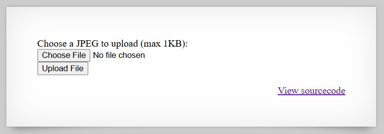
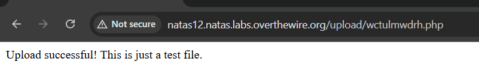

# [Over The Wire (natas)] – [[Platform](http://natas12.natas.labs.overthewire.org/)] – [09/22/2025]

## Objective
Find the password for the next Natas level by exploiting the vulnerability on this page.  

## Environment / Platform
- Platform: OverTheWire – Natas
- Level: [10]
- Difficulty: [Medium]

## Tools Used
- Chromium Browser

## Login
1. Logged in with credentials:
   - **Username**: `natas12`
   - **Password**: `XXXXXX`
  
2. Screenshot:
   
   
   - this prompted that I should check the sourcecode by clicking the link `http://natas12.natas.labs.overthewire.org/index-source.html`

3. Observed Page Content
   
   ```php
   

      function genRandomString() {
         $length = 10;
         $characters = "0123456789abcdefghijklmnopqrstuvwxyz";
         $string = "";

         for ($p = 0; $p < $length; $p++) {
            $string .= $characters[mt_rand(0, strlen($characters)-1)];
         }

         return $string;
      }

   ```
   1. This function generates string of mixed alphanumeric of 10 characters long.
   
   ```php

      function makeRandomPath($dir, $ext) {
         do {
         $path = $dir."/".genRandomString().".".$ext;
         } while(file_exists($path));
         return $path;
      }

   ```
   2. This function takes directory and extension and returns a path by appending "/" random string and "." extension.

   ```php

      function makeRandomPathFromFilename($dir, $fn) {
         $ext = pathinfo($fn, PATHINFO_EXTENSION);
         return makeRandomPath($dir, $ext);
      }

   ```
   3. This function takes in directory and filename then extracts the extension using pathinfo method. 

   ```php

      if(array_key_exists("filename", $_POST)) {
         $target_path = makeRandomPathFromFilename("upload", $_POST["filename"]);


            if(filesize($_FILES['uploadedfile']['tmp_name']) > 1000) {
            echo "File is too big";
         } else {
            if(move_uploaded_file($_FILES['uploadedfile']['tmp_name'], $target_path)) {
                  echo "The file <a href=\"$target_path\">$target_path</a> has been uploaded";
            } else{
                  echo "There was an error uploading the file, please try again!";
            }
         }
      } else {
   ```
   4. This logic block checks that the object received through `POST` request body contains a key named `filename` and if so it creates a random path name appended to the directory `upload`.

   5. If the `uploadedfile` size is bigger than 1000 bytes or 1MB then it would return an error message.

   6. Then if the error is not triggered will upload the file and return the `a` html element to link to the location of the uploaded file.
   
   7. When the main page loads the html response contains a hidden input that is named filename. This is the `extension` gets extracted from.

   ``` html
      <input type="hidden" name="filename" value="9m350b6wvg.jpg" />
   ``` 
4. Steps taken:
   
   1. I created a simple php file that could be uploaded and would return a string to confirm it would run if uploaded.

   ```php
      echo "Upload successful! This is just a test file.";
   ```
   2. The file uploaded was then saved as jpg file and did not run. The next step was to send the request with `Reapeter` in Burp Suite.

   

   3. Since the submit was successful and the vulnerability was proven, it was time to exploit. We needed a small php script that would return the contents of the server file for the next level. 

   ```php
      echo htmlspecialchars(file_get_contents("/etc/natas_webpass/natas13"));
   ```

   4. This script ran and returned the flag.


---

🔑 **Why this works**: 

   - The upload functionality trusts the filename value from the form instead of the actual file extension.

   - The PHP functions makeRandomPathFromFilename() and makeRandomPath() preserve the extension provided in the filename field.

   - Because the hidden filename input can be modified (using Burp Suite or other intercepting proxies), an attacker can change it to .php and bypass the default .jpg extension.

   - Once uploaded, the server executes PHP files in the upload/ directory, allowing arbitrary code execution.

   - Using a small PHP snippet (like file_get_contents()), an attacker can read sensitive files on the server, such as the password for the next Natas level.

---

💥 **Impact**

   - **Arbitrary File Upload**: Attackers can upload and execute PHP scripts on the server.

   - **Remote Code Execution (RCE)**: The uploaded PHP file can execute any PHP code, potentially allowing full control over the server.

   - **Sensitive Information Disclosure**: Files containing credentials, configuration, or other secrets can be read (e.g., /etc/natas_webpass/natas13).

   - **Server Compromise**: If left unpatched in a real environment, this could lead to complete system compromise, including privilege escalation, data theft, or persistent access.


---
  
🛠️ **Remediation**

   - **Do Not Trust User Input**: Never rely on a client-provided filename to determine the file extension.

   - **Whitelist Allowed File Types**: Only allow specific, safe extensions (e.g., .jpg, .png) and reject everything else.

   - **Store Uploads Outside the Web Root**: Store files in a directory that the server does not execute as PHP. Serve them via a proxy or a script that reads them safely.

   - **Validate File Contents**: Check that the uploaded file’s MIME type and actual contents match the expected type.

   - **Randomize Filenames**: Continue to use randomized filenames to prevent overwriting or guessing.

   - **Limit File Size**: Keep a strict size limit and validate it server-side (already partially implemented).

   - **Monitor and Log Uploads**: Track uploads to detect suspicious activity.
   