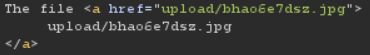
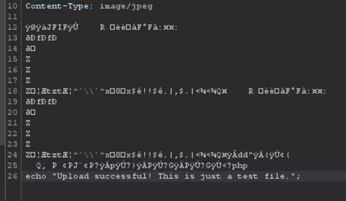

# [Over The Wire (natas)] – [[Platform](http://natas13.natas.labs.overthewire.org/)] – [09/23/2025]

## Objective
Find the password for the next Natas level by exploiting the vulnerability on this page.  

## Environment / Platform
- Platform: OverTheWire – Natas
- Level: [13]
- Difficulty: [Medium]

## Tools Used
- Chromium Browser
- Burp Suite (proxy + repeater)

## Login
1. Logged in with credentials:
   - **Username**: `natas13
   - **Password**: `XXXXXX`
  
2. Screenshot:
   
   
   - this prompted that I should check the sourcecode by clicking the link `http://natas13.natas.labs.overthewire.org/index-source.html`

3. Observed Page Content
   
   ```php
   

      function genRandomString() {
         $length = 10;
         $characters = "0123456789abcdefghijklmnopqrstuvwxyz";
         $string = "";

         for ($p = 0; $p < $length; $p++) {
            $string .= $characters[mt_rand(0, strlen($characters)-1)];
         }

         return $string;
      }

   ```
   1. This function generates string of mixed alphanumeric of 10 characters long.
   
   ```php

      function makeRandomPath($dir, $ext) {
         do {
         $path = $dir."/".genRandomString().".".$ext;
         } while(file_exists($path));
         return $path;
      }

   ```
   2. This function takes directory and extension and returns a path by appending "/" random string and "." extension.

   ```php

      function makeRandomPathFromFilename($dir, $fn) {
         $ext = pathinfo($fn, PATHINFO_EXTENSION);
         return makeRandomPath($dir, $ext);
      }

   ```
   3. This function takes in directory and filename then extracts the extension using pathinfo method. 

   ```php

      if(array_key_exists("filename", $_POST)) {
         $target_path = makeRandomPathFromFilename("upload", $_POST["filename"]);

         $err=$_FILES['uploadedfile']['error'];
         if($err){
            if($err === 2){
                  echo "The uploaded file exceeds MAX_FILE_SIZE";
            } else{
                  echo "Something went wrong :/";
            }
         } else if(filesize($_FILES['uploadedfile']['tmp_name']) > 1000) {
            echo "File is too big";
         } else if (! exif_imagetype($_FILES['uploadedfile']['tmp_name'])) {
            echo "File is not an image";
         } else {
            if(move_uploaded_file($_FILES['uploadedfile']['tmp_name'], $target_path)) {
                  echo "The file <a href=\"$target_path\">$target_path</a> has been uploaded";
            } else{
                  echo "There was an error uploading the file, please try again!";
            }
         }
      } else {
   ```
   4. This logic block checks that the object received through `POST` request body contains a key named `filename` and if so it creates a random path name appended to the directory `upload`.

   5. If the `uploadedfile` size is bigger than 1000 bytes or 1MB then it would return an error message.

   6. The code then also checks using `exif_imagetype`which uses the content to determine the extension type.

   6. Then if the error is not triggered will upload the file and return the `a` html element to link to the location of the uploaded file.
   
   7. When the main page loads the html response contains a hidden input that is named filename. This is the `extension` gets extracted from.

   ``` html
      <input type="hidden" name="filename" value="9m350b6wvg.jpg" />
   ``` 
4. Steps taken:
   
   1. I had to first find a jpg file that was much smaller than 1kb which in itself proved a challange, but after compressing a random image was done. I created several copies for experimenting just to be safe.

   2. Using `cmd` to inject php code into the jpg file 

   ```php
      echo "Upload successful! This is just a test file.";
   ```

   ```cmd
      type test.php >> test.png
   ```

   

   3. The response was the link of the uploaded file which could be read in Burp Suite using Repeater tab.

   

   4. Altering the `filename` hidden input to `php` instead of using `jpg` we can upload the jpg file as php and the injected script would run. 
   
   ```php
      echo htmlspecialchars(file_get_contents("/etc/natas_webpass/natas14"));
   ```
   5. This returned the flag.

---

🔑 **Why this works**: 

The vulnerability exists because the upload functionality **relies on user-controlled input** to determine the file extension (`filename` hidden field) and only superficially validates the file using `exif_imagetype()`. 

Key factors:

- The server uses `pathinfo($_POST['filename'], PATHINFO_EXTENSION)` to determine the extension, which can be manipulated.
- The `exif_imagetype()` check only validates that the file **starts with valid image header bytes**, not that it is a “pure image”.
- There is no enforcement to ensure uploaded files cannot be executed as PHP if saved with a `.php` extension.
- By uploading a valid image (under 1KB) with **PHP code appended** and changing the hidden `filename` field to `.php`, the server saves the file as executable PHP in a web-accessible folder. This allows arbitrary code execution.


---

💥 **Impact**

  
This vulnerability has **high severity** because it allows **remote code execution**:

- An attacker can run arbitrary PHP code on the server.
- Sensitive information can be exposed, e.g., `/etc/natas_webpass/natas14`.
- The attacker can potentially escalate the attack to read system files, compromise other users, or pivot to other parts of the infrastructure.
- Any server relying on this upload mechanism without further restrictions is exposed to serious risk.


---
  
🛠️ **Remediation**

   
To secure the file upload functionality:

1. **Enforce strict file extensions**:
   - Only allow whitelisted extensions (`.jpg`, `.png`, `.gif`) and ignore user-provided `filename`.
2. **Store uploaded files outside the web root**:
   - Prevent uploaded files from being directly executable.
3. **Validate file contents**:
   - Use `exif_imagetype()` or similar to ensure it matches the allowed type.
   - Optionally, use additional checks on file headers and sizes.
4. **Rename files on upload**:
   - Generate server-side random filenames to prevent user control.
5. **Limit file size**:
   - Already partially implemented, but ensure it is strictly enforced.
6. **Do not execute uploaded content**:
   - Never save user-uploaded files with `.php` or other executable extensions.
7. **Consider further security controls**:
   - Antivirus scanning, content inspection, and server-side sandboxing can reduce risk of malicious uploads.
