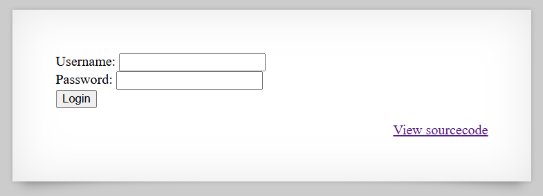
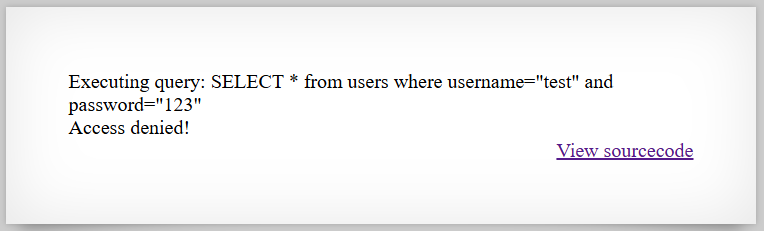
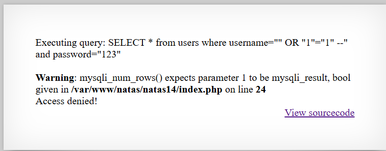

# [Over The Wire (natas)] – [[Platform](http://natas14.natas.labs.overthewire.org/)] – [09/24/2025]

## Objective
Find the password for the next Natas level by exploiting the vulnerability on this page.  

## Environment / Platform
- Platform: OverTheWire – Natas
- Level: [14]
- Difficulty: [Easy]

## Tools Used
- Chromium Browser
- Burp Suite (proxy + repeater)

## Login
1. Logged in with credentials:
   - **Username**: `natas14
   - **Password**: `XXXXXX`
  
2. Screenshot:
   
   
   - this prompted that I should check the sourcecode by clicking the link `http://natas14.natas.labs.overthewire.org/index-source.html`

3. Observed Page Content
   ```php
      if(array_key_exists("username", $_REQUEST)) {
         $link = mysqli_connect('localhost', 'natas14', '<censored>');
         mysqli_select_db($link, 'natas14');

         $query = "SELECT * from users where username=\"".$_REQUEST["username"]."\" and password=\"".$_REQUEST["password"]."\"";
         if(array_key_exists("debug", $_GET)) {
            echo "Executing query: $query<br>";
         }

         if(mysqli_num_rows(mysqli_query($link, $query)) > 0) {
                  echo "Successful login! The password for natas15 is <censored><br>";
         } else {
                  echo "Access denied!<br>";
         }
         mysqli_close($link);
      } else {
   ```
   - this roughly translates into 
  
   1. If the request contains a key "username" continue.
   
   2. Create a database connection using localhost and user natas14 and password.

   3. Set query variable = select all user where username is equal to the username in the request and password is the password in the request also.

   4. If the key "debug" in the GET route exists then print out "Executing query: ..."-

   5. If there are any rows from the query after requesting from the database using connection and query previously created then return success message other wise state access defined.

   6. Close the database connection. 
   
4. Steps taken:

   1. Taking into consideration that the query directly uses the username and password from the request params and that I can view a debugged version of what I am trying to submit.

   2. I attempted checking the params of `/?username=test&password=123&debug` this returned

   

   3. With this test result wecan identify that both the username and password get wrapped in `""`

   4. The next payload I attempted was `/?username=%22%20OR%20%221%22=%221%22%20--&password=123&debug`

   

   5. the expected `--` for notating in SQL didn't seem to work as expected. So we changed it to `#`, using `" OR "1"="1" #"` for the username. This returned the flag
   
   

---

🔑 **Why this works**: 

   - The application directly concatenates user input for both username and password into the SQL query.
  
   - There is **no input sanitization** or use of prepared statements.

   - An attacker can close the initial quotes and inject a **logical condition that always evaluates to true**.

   - Appending a comment character (`#`) causes the rest of the query, including the password check, to be ignored.

   - This allows authentication to be bypassed and the next level’s password to be retrieved.


---

💥 **Impact**

   - An attacker can **bypass authentication** without knowing valid credentials.

   - Sensitive information, such as the password for the next level, can be exposed.

   - Demonstrates a **critical weakness** in input handling that could be exploited in real-world applications for unauthorized access or privilege escalation.

   - Reveals that debug output exposing raw queries can **leak sensitive information**.


---
  
🛠️ **Remediation**

   - Avoid directly concatenating user input into SQL queries.

   - Use **parameterized queries** or **prepared statements** with bound variables.

   - Apply **input validation and escaping mechanisms** to prevent special characters from altering SQL logic.

   - Remove or restrict debug output that exposes raw SQL queries in production environments.