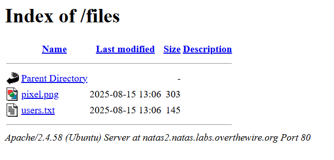

# [Over The Wire (natas)] – [[Platform](http://natas2.natas.labs.overthewire.org/)] – [09/18/2025]

## Objective
Find the password for the next Natas level by exploiting the vulnerability on this page.  

## Environment / Platform
- Platform: OverTheWire – Natas
- Level: [2]
- Difficulty: [Easy]

## Tools Used
- Chromium Browser (Browser DevTools)

## Steps Taken
1. Logged in with credentials:
   - **Username**: `natas2`
   - **Password**: `XXXXXX`
  
2. Devtools - Elements:
   - nothing obvious in the html elements or css files. 
   - nothing obvious in the sources tab
   - after inspecting closly the only other html element was an img element with the src = 'files.pixel.png'
   - in the sources tab for the site there is a directory "files"
   - pieceing together that there must be a path to the "files" endpoint.
  
3. Observed page content:
   
   ```html
    <div id="content">
      There is nothing on this page
      
    </div>

4. Screenshot
   -  Resdirecting to the "files" end point a possible target text file found.
  
   
---

🔑 Why this works:  
- The flag starts to become more elusive and not as straight-forward to obtain. Logic can slowly be pieced together to find hidden endpoint paths.