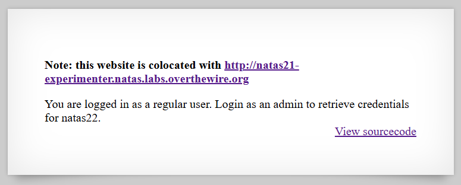

# [Over The Wire (natas)] – [[Platform](http://natas21.natas.labs.overthewire.org/)] – [09/29/2025]

## Objective
Find the password for the next Natas level by exploiting the vulnerability on this page.  

## Environment / Platform
- Platform: OverTheWire – Natas
- Level: [21]
- Difficulty: [Easy]

## Tools Used
- Chromium Browser
- Burp Suite (proxy + repeater)

## Login
1. Logged in with credentials:
   - **Username**: `natas21
   - **Password**: `XXXXXX`
  
2. Screenshot:
   
   
   - this prompted that I should check the sourcecode by clicking the link `http://natas21.natas.labs.overthewire.org/index-source.html`

   

   - this prompted that I should check the sourcecode by clicking the link `http://natas21-experimenter.natas.labs.overthewire.org/index-source.html`

3. Observed Page Content

```php
      function print_credentials() { /* {{{ */
         if($_SESSION and array_key_exists("admin", $_SESSION) and $_SESSION["admin"] == 1) {
         print "You are an admin. The credentials for the next level are:<br>";
         print "<pre>Username: natas22\n";
         print "Password: <censored></pre>";
         } else {
         print "You are logged in as a regular user. Login as an admin to retrieve credentials for natas22.";
         }
      }
```
   - This checks for the admin key value in Session and if that value is equal to 1. If so, then flag displayed.


```php
      session_start();
      print_credentials();   
```
   - This initiates a session and prints credentials. 


```php
      session_start();

      // if update was submitted, store it
      if(array_key_exists("submit", $_REQUEST)) {
         foreach($_REQUEST as $key => $val) {
         $_SESSION[$key] = $val;
         }
      }  
```
   - This checks if there is a key of "submit" in the request. If so, for each key and value pair you would assign in the session the value into the array. 

 
```php
      if(array_key_exists("debug", $_GET)) {
         print "[DEBUG] Session contents:<br>";
         print_r($_SESSION);
      }   
```
   - If the key "debug" present in the GET request you would print out debug messaging.


```php
      $validkeys = array("align" => "center", "fontsize" => "100%", "bgcolor" => "yellow");
      $form = "";   
```
   - Instantiate validkeys for the default values and form as empty string. 


```php
      $form .= '<form action="index.php" method="POST">';
      foreach($validkeys as $key => $defval) {
         $val = $defval;
         if(array_key_exists($key, $_SESSION)) {
            $val = $_SESSION[$key];
         } else {
            $_SESSION[$key] = $val;
         }
         $form .= "$key: <input name='$key' value='$val' /><br>";
      }

```
   - Append to the form variable the form html element for POST and action set to "index.php". Then the value variable instantiated to the default value if the key exists in the Session then update the variable to that value otherwise set that key-value in the Session array to the default. We concatenate each key and HTML input element with the name and value assigned separated by a linebreak.


```php
      $form .= '<input type="submit" name="submit" value="Update" />';
      $form .= '</form>';

      $style = "background-color: ".$_SESSION["bgcolor"]."; text-align: ".$_SESSION["align"]."; font-size: ".$_SESSION["fontsize"].";";
      $example = "<div style='$style'>Hello world!</div>";  
```
   - We concatenate to the form variable the HTML input element for submit and value of "Update". We then instantiate a style variable with the background color, text-alignment, and font-size as per each value in the Session array. We also instantiate an example variable to a simple div with the previously stated styling, the displaying text is "Hello world!".


---
  

     
4. Steps taken (Broken Access Control):

   1. First I wanted to check what was the debugged value I was sending to the backend. Submitting the form in the second instance of the app to endpoint `/index.php?debug`.

   ```html
      [DEBUG] Session contents:<br>Array
      (
         [debug] => 
         [align] => center
         [fontsize] => 100%
         [bgcolor] => yellow
         [submit] => Update
      )
   ``` 

   2. This indicated that the param is taking in as a key-value pair and therefor should be able to injected as `admin=1` and included as endpoint `/index.php?admin=1&debug` 
   ```html
         [DEBUG] Session contents:<br>Array
         (
            [admin] => 1
            [debug] => 
            [align] => center
            [fontsize] => 100%
            [bgcolor] => yellow
            [submit] => Update
         )
   ```

   3. The next step was to check if I was logged in correctly in the first instance of the app by updating the PHPSESSID to equal the second instance. 
   
   4. This produced the flag.
   

---

🔑 **Why this works**: 

   - The application blindly copies all request parameters into $_SESSION (foreach($_REQUEST as $key => $val) { $_SESSION[$key] = $val; }), allowing an attacker to set arbitrary session keys (e.g. admin=1).

   - The code checks session state ($_SESSION["admin"] == 1) for authorization, so an attacker who can set that key gains admin privileges (privilege escalation / authorization bypass).

   - A debug endpoint (?debug) prints session contents, confirming the injected keys and easing exploitation.

   - Session fixation is possible: reusing a session cookie from one app instance in another lets the attacker make that session appear privileged to the target instance.

   - There is no validation, sanitization, or server-side enforcement of which session keys are allowed or what values are permitted.

---

💥 **Impact**

   - **Unauthorized privilege escalation** — an attacker can become “admin” and access sensitive data (here, the next level credentials).

   - **Information disclosure** — debug output reveals session internals and aids exploitation.

   - **Session fixation / account takeover** — attacker-controlled session IDs can be reused to hijack or escalate sessions.

   - **Low attack complexity, high reliability** — trivial HTTP requests suffice, making exploitation easy to automate and scale.

   - **Wider system risk** — if similar session handling exists elsewhere, attacker could manipulate other application behavior or access additional functionality.

---
  
🛠️ **Remediation**

   - Never copy $_REQUEST (or user input) directly into $_SESSION. Only set session values on the server after explicit, validated operations.

   - Whitelist allowed session keys and validate values/types before storing (e.g., only accept align, fontsize, bgcolor from the form).

   - Remove or restrict debug endpoints — do not print session contents in production; require authentication or remove entirely.

   - Regenerate session ID on privilege changes (session_regenerate_id(true)) and bind sessions to additional context (IP or user-agent) where appropriate.

   - Harden session cookies: set HttpOnly, Secure, and appropriate SameSite attributes.

   - Perform server-side authorization checks (never rely solely on client-set flags); use a separate, server-controlled authorization mechanism.

   - Log and monitor suspicious session-setting behavior and unexpected session keys being introduced.