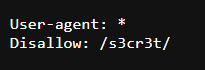
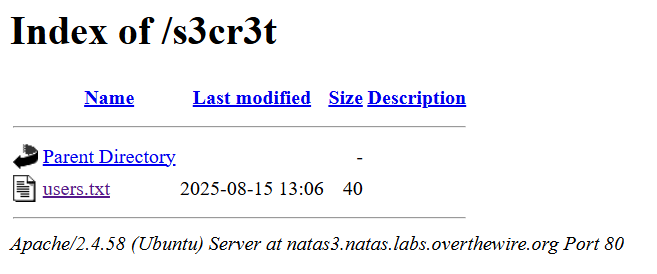

# [Over The Wire (natas)] – [[Platform](http://natas3.natas.labs.overthewire.org/)] – [09/19/2025]

## Objective
Find the password for the next Natas level by exploiting the vulnerability on this page.  

## Environment / Platform
- Platform: OverTheWire – Natas
- Level: [3]
- Difficulty: [Easy]

## Tools Used
- Chromium Browser (Browser DevTools)

## Steps Taken
1. Logged in with credentials:
   - **Username**: `natas3`
   - **Password**: `XXXXXX`
  
2. Devtools - Elements:
   - nothing obvious in the html elements or css files. 
   - nothing obvious in the sources tab
   - tried different manual fuzzing of endpoints 

4. Screenshot
   - tried the robots.txt endpoint
   - this revealed a route to discourage bots from "s3cr3t" directory
  
   
   
  
   
---

🔑 Why this works:  
- Sometimes the techniques we use to prevent the bots from indexing certain directories also tips off where to look specifically.