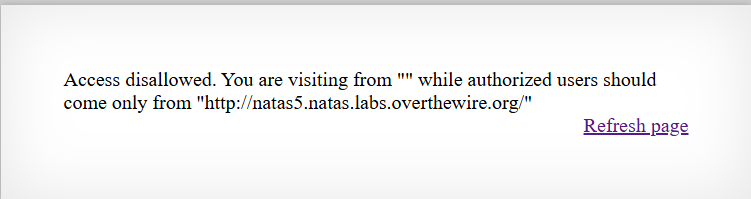

# [Over The Wire (natas)] – [[Platform](http://natas3.natas.labs.overthewire.org/)] – [09/19/2025]

## Objective
Find the password for the next Natas level by exploiting the vulnerability on this page.  

## Environment / Platform
- Platform: OverTheWire – Natas
- Level: [4]
- Difficulty: [Easy]

## Tools Used
- Burp Suite (proxy + repeater)

## Steps Taken
1. Logged in with credentials:
   - **Username**: `natas4`
   - **Password**: `XXXXXX`
  
2. Screenshot:
   
   
   - this prompted that the server is checking the origin of the request

4. Burp Suite (proxy + repeater)
   - checking the request information there was no heading for "Referer or Referrer"
   - by adding the expected value in the screenshot "Referer: http://natas5.natas.labs.overthewire.org/" I managed to spoof by.
   
---

🔑 Why this works:  
- HTTP header injection / manipulation (Improper access control or Weak referer-based access restriction) also known as spoofing - works by bypassing security checks if we know what value they are expecting to see is. 

💥 **Impact**
   - By relying on the `Referer` header for access control, an attacker can spoof the value and bypass restrictions to gain unauthorized access to sensitive resources.
  
🛠️ **Remediation**
   - Do not rely on client-supplied headers for authorization. Implement proper server-side session or role-based access controls.