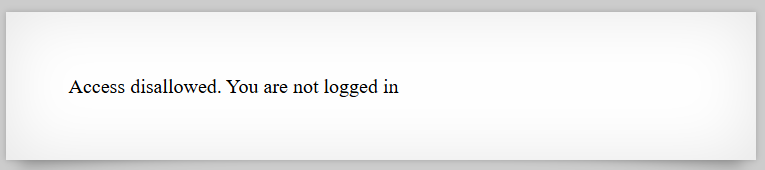

# [Over The Wire (natas)] – [[Platform](http://natas5.natas.labs.overthewire.org/)] – [09/19/2025]

## Objective
Find the password for the next Natas level by exploiting the vulnerability on this page.  

## Environment / Platform
- Platform: OverTheWire – Natas
- Level: [5]
- Difficulty: [Easy]

## Tools Used
- Burp Suite (proxy + repeater)

## Steps Taken
1. Logged in with credentials:
   - **Username**: `natas5`
   - **Password**: `XXXXXX`
  
2. Screenshot:
   
   
   - this prompted that I should check a header in the request

4. Burp Suite (proxy + repeater)
   - Request heading-  Cookie: loggedin=0
   - swap the 0 to a 1 to log the session in
   
---

🔑 Why this works:  
   - The application relies only on a client-side cookie (loggedin) to determine authentication status. By changing the value from 0 to 1, an attacker can trick the application into believing they are logged in, without needing valid credentials.

💥 **Impact**
   - Authentication Bypass: An attacker can gain access to restricted functionality without valid login.

   - Privilege Escalation: If higher roles (e.g., admin) are tied to cookie values, the attacker could gain unauthorized access.

   - Data Exposure / Account Takeover: Sensitive information could be accessed by anyone modifying their cookie.
  
🛠️ **Remediation**
   - Server-side Enforcement: Always enforce authentication and authorization on the server. Never trust client-side indicators like loggedin=1.

   - Use Secure Session Management:

      - Generate a session token on login.

      - Store it securely (e.g., HttpOnly, Secure cookies).

      - Validate session tokens against the server’s session store for every request.

   - Defense in Depth: Implement proper role-based access control (RBAC) on the backend.