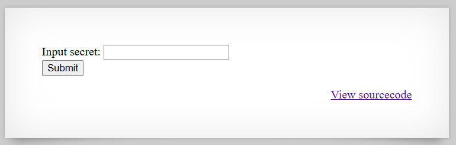

# [Over The Wire (natas)] – [[Platform](http://natas6.natas.labs.overthewire.org/)] – [09/20/2025]

## Objective
Find the password for the next Natas level by exploiting the vulnerability on this page.  

## Environment / Platform
- Platform: OverTheWire – Natas
- Level: [6]
- Difficulty: [Easy]

## Tools Used
- Chromium Browser

## Steps Taken
1. Logged in with credentials:
   - **Username**: `natas6`
   - **Password**: `XXXXXX`
  
2. Screenshot:
   
   
   - this prompted that I should check the sourcecode

3. Observed Page Content:
   ``` html
   <?

   include "includes/secret.inc";

      if(array_key_exists("submit", $_POST)) {
         if($secret == $_POST['secret']) {
         print "Access granted. The password for natas7 is <censored>";
      } else {
         print "Wrong secret";
      }
      }
   ?>

   ```
   - directory exposed `includes/secret.inc`
   - this exposes the actual secret value
   - taking the value and submitting the form on the root directory returned the flag.

   
---

🔑 Why this works:  
   - The vulnerability arises because the application directly includes a file (includes/secret.inc) that contains sensitive information (the secret key). This file is accessible from the web server without proper restrictions, allowing attackers to view its contents. By retrieving the secret value from this file and submitting it through the provided form, authentication is bypassed, and the password for the next level is exposed.

💥 **Impact**

   If this issue existed in a real-world application, the consequences could include:
   - Credential disclosure – Attackers gain access to hidden or protected credentials.

   - Privilege escalation – Unauthorized users could obtain higher-level access by reusing exposed secrets.

   - Application compromise – Sensitive files could contain database credentials, API keys, or other secrets, leading to complete system takeover.
  
🛠️ **Remediation**

To prevent this vulnerability, developers should:

   - **Restrict access to sensitive files** – Store secrets outside of the web root or protect them with strict server-side permissions.

   - **Use environment variables or secure configuration stores** – Avoid hardcoding or exposing secrets in web-accessible files.

   - **Implement proper access controls** – Ensure that sensitive directories and files cannot be accessed directly by users.

   - **Conduct code reviews and security testing** – Regularly audit applications for exposed files and misconfigurations.
