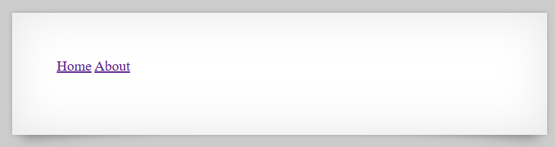

# [Over The Wire (natas)] – [[Platform](http://natas7.natas.labs.overthewire.org/)] – [09/20/2025]

## Objective
Find the password for the next Natas level by exploiting the vulnerability on this page.  

## Environment / Platform
- Platform: OverTheWire – Natas
- Level: [7]
- Difficulty: [Easy]

## Tools Used
- Chromium Browser

## Steps Taken
1. Logged in with credentials:
   - **Username**: `natas7`
   - **Password**: `XXXXXX`
  
2. Screenshot:
   
   
   - this prompted that I should check the sourcecode

3. Observed Page Content:
   ``` html
   <div id="content">

      <a href="index.php?page=home">Home</a>
      <a href="index.php?page=about">About</a>
      <br>
      <br>

      <!-- hint: password for webuser natas8 is in /etc/natas_webpass/natas8 -->
   </div>

   ```
   - when either link `Home` or `About` are redirected to param `page=`
   - if taking the hint and changing the param to the `/etc/natas_webpass/natas8`
   - this rewarded with the flag.

   
---

🔑 Why this works:  
   - The application dynamically includes files based on the user-controlled page parameter in the URL (e.g., index.php?page=home). Because there is no validation or restriction on what can be passed to page, an attacker can supply an arbitrary file path. By pointing the parameter to /etc/natas_webpass/natas8, the server reads and returns the contents of that file, exposing sensitive information. This is a classic example of a Local File Inclusion (LFI) vulnerability.

💥 **Impact**

   If this type of vulnerability existed in a production system, potential risks include:

   -  Sensitive data disclosure – Attackers could read configuration files, credentials, or API keys stored on the server.

   -  System compromise – Depending on server configuration, attackers could escalate this to Remote Code Execution (RCE) by including log files or injecting malicious input.

   -  Reconnaissance – Reading files such as /etc/passwd could help attackers gather information about system users, aiding in further exploitation.

Overall, this would be considered a high-severity vulnerability due to the potential for full system compromise.
  
🛠️ **Remediation**

To prevent this vulnerability, developers should:

   -  **Whitelist allowed files** – Only permit predefined values (e.g., home, about) instead of directly including user input.

   -  **Use secure file mapping** – Map input parameters to safe filenames stored in a controlled lookup table.

   -  **Disable remote file inclusion** – Ensure PHP allow_url_include and allow_url_fopen are turned off.

   -  **Apply the principle of least privilege** – Restrict web server permissions so it cannot read sensitive system files.

   -  **Conduct regular security testing** – Perform code reviews and dynamic testing to detect unsafe file inclusion.
