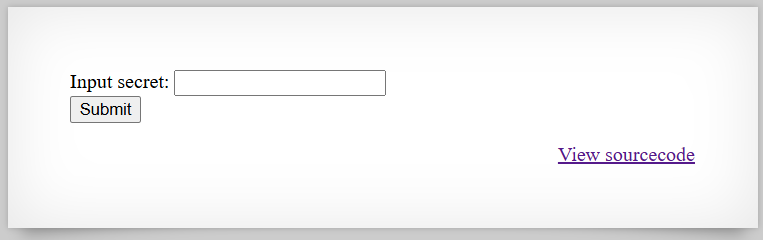

# [Over The Wire (natas)] – [[Platform](http://natas8.natas.labs.overthewire.org/)] – [09/20/2025]

## Objective
Find the password for the next Natas level by exploiting the vulnerability on this page.  

## Environment / Platform
- Platform: OverTheWire – Natas
- Level: [8]
- Difficulty: [Easy]

## Tools Used
- Chromium Browser

## Steps Taken
1. Logged in with credentials:
   - **Username**: `natas8`
   - **Password**: `XXXXXX`
  
2. Screenshot:
   
   
   - this prompted that I should check the sourcecode by clicking the link `http://natas8.natas.labs.overthewire.org/index-source.html`

3. Observed Page Content:
   ``` html
   <?

      $encodedSecret = "3d3d516343746d4d6d6c315669563362";

      function encodeSecret($secret) {
         return bin2hex(strrev(base64_encode($secret)));
      }

      if(array_key_exists("submit", $_POST)) {
         if(encodeSecret($_POST['secret']) == $encodedSecret) {
         print "Access granted. The password for natas9 is <censored>";
         } else {
         print "Wrong secret";
         }
      }
   ?>

   ```
   - I see the final encoded product and the instructions to acheive it
  
   - take input and use base64 encoding, then you reverse the string, and finally a bin2hex
   - I decided to create a piped version in linux terminal 
  
   ```bash
      printf "hello" | base64 -w 0 | rev | xxd -p
      3d38476273564761
    ```

   - then of course we need a way to reverse-engineer the process
  
   ```bash
      echo -n "3d38476273564761" | xxd -r -p | rev | base64 -d; echo
      hello
   ```

   - after proving that they both work I used the provided encodedSecret in the page content `3d3d516343746d4d6d6c315669563362`

   - This provided the *Input secret* that root directory needed for the flag

   
---

🔑 Why this works:  

   The application encodes the submitted secret using a predictable sequence: Base64 encode → reverse → bin2hex. The server then compares the result to a stored encoded value ($encodedSecret). Because this encoding is deterministic and reversible, an attacker can reverse-engineer the process:

   - Convert the stored hex string back to bytes (hex2bin).

   - Reverse the string to undo strrev.

   - Base64 decode to retrieve the original secret.

   Once the original secret is obtained, it can be submitted to the form to bypass the check and obtain the password for the next level. This is essentially a weak client-side-like encoding vulnerability, where the “secret” can be recovered without knowing the original input.

💥 **Impact**

If a similar encoding scheme were used in a real system:

   - Confidential data exposure – Secrets, passwords, or tokens can be recovered because the encoding is not cryptographically secure.

   - Authentication bypass – Attackers could gain unauthorized access by reconstructing encoded secrets.

   - Potential chain attacks – Access to one secret may lead to further compromise of related accounts or system resources.

While this example is educational, in production it would be considered high-risk due to the recoverability of sensitive information.
  
🛠️ **Remediation**

To prevent this type of vulnerability:

   - Use proper cryptography – Store secrets using strong hash functions with salt (e.g., bcrypt, Argon2) instead of reversible encodings.

   - Avoid predictable reversible transformations – Encoding alone is not sufficient to protect sensitive data.

   - Limit direct comparisons with sensitive values – Never expose encoded secrets or allow easy reverse-engineering.

   - Secure input handling – Consider additional server-side protections such as rate-limiting and monitoring to detect brute-force attempts.
