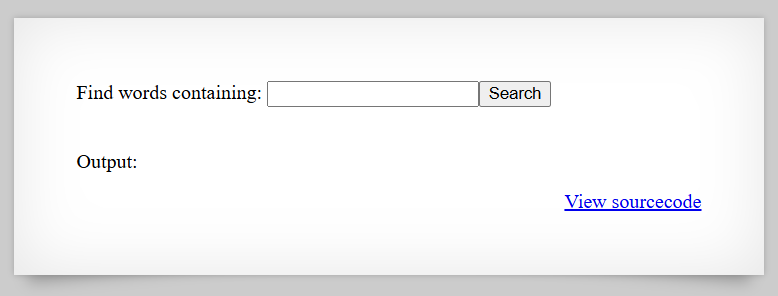

# [Over The Wire (natas)] – [[Platform](http://natas9.natas.labs.overthewire.org/)] – [09/22/2025]

## Objective
Find the password for the next Natas level by exploiting the vulnerability on this page.  

## Environment / Platform
- Platform: OverTheWire – Natas
- Level: [9]
- Difficulty: [Easy]

## Tools Used
- Chromium Browser

## Login
1. Logged in with credentials:
   - **Username**: `natas9`
   - **Password**: `XXXXXX`
  
2. Screenshot:
   
   
   - this prompted that I should check the sourcecode by clicking the link `http://natas9.natas.labs.overthewire.org/index-source.html`

3. Observed Page Content:
   ``` html
   <pre>
      <?
      $key = "";

      if(array_key_exists("needle", $_REQUEST)) {
         $key = $_REQUEST["needle"];
      }

      if($key != "") {
         passthru("grep -i $key dictionary.txt");
      }
      ?>
   </pre>

   ```
4. Steps Taken
   1. This tells me that the params for needle and the variable key are used 
  
   2. After changing payloads I noticed that you can use `; & |` to use command injection

   3. I tried first checking this `pwd` where I was directory I was located in `/var/www/natas/natas9` was the output
   
   4. I then decided to check If I could list the contents of the `etc` folder. I used find to filter anything with "pass". 
      - natas_pass
      - natas_webpass
      - passwd
      - passwd-
  
   5. All expect for "natas_webpass" showed the dictionary.txt file only. This directory showed files for different levels. 

   6. Tyring the payload `xxx; cat /etc/natas_webpass/natas10` and this returned the flag. 
  

---

🔑 Why this works: 

   The page takes user input from the needle parameter and directly injects it into a shell command:

   ```php
      passthru("grep -i $key dictionary.txt");
   ```

   - passthru() executes the command in the shell.

   - key variable comes directly from user input ($_REQUEST["needle"]) without any sanitization.

   - This makes the application vulnerable to Command Injection: an attacker can append shell operators or commands to execute arbitrary shell commands on the server.

---

💥 **Impact**

   - Sensitive Data Exposure: The attacker can read files outside the intended scope (like /etc/natas_webpass/natas10) containing passwords or secrets.

   - Full Command Execution: Any command available on the server can be executed, potentially modifying files, installing malware, or pivoting to other systems.

   - Server Compromise: This is a critical vulnerability. If exploited on a real server, it could lead to complete system takeover.

---
  
🛠️ **Remediation**

   1. **Avoid Shell Execution with Unsanitized Input**: Do not pass user input directly to shell commands.

   2. **Use Safer Alternatives**:

      - Use PHP functions that avoid shell interpretation, e.g., file_get_contents(), preg_grep(), or fopen() to search inside files.
  
   ```php
      $lines = file("dictionary.txt");
      $matches = preg_grep("/$key/i", $lines);
      foreach ($matches as $line) {
         echo htmlspecialchars($line);
      }
   ```

   3. **Escape Input if Shell Execution is Necessary**:
   - Use escapeshellarg() to sanitize input before using it in a shell command:
   ```php
      $safe_key = escapeshellarg($key);
      passthru("grep -i $safe_key dictionary.txt");
   ```
   1. **Principle of Least Privilege**:
   - Ensure web application users have minimal file system permissions to prevent sensitive data exposure if a vulnerability is exploited.
